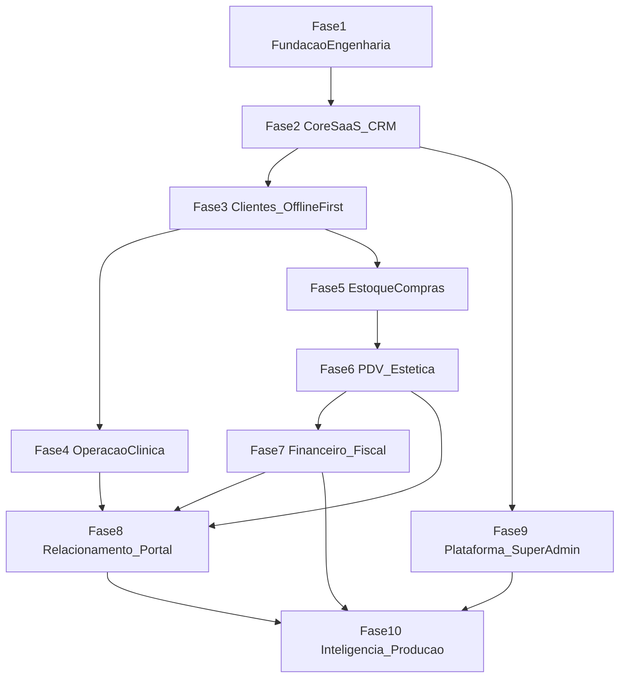

# Roadmap de Desenvolvimento — VetNexus / SysVet

Este roadmap define as etapas de desenvolvimento do SaaS veterinário e petshop **VetNexus** (código: **SysVet**), alinhado à arquitetura documentada em [`agents.md`](agents.md), [`structure.md`](structure.md), [`functions.md`](functions.md) e [`backoffice.md`](backoffice.md).

**Estimativas:** Story Points (SP) na sequência de Fibonacci (1, 2, 3, 5, 8, 13, 21). SP medem esforço relativo, não prazo.

**Documentos-fonte de escopo:**
- [`functions.md`](functions.md) — operação da clínica/petshop (tenant-side)
- [`backoffice.md`](backoffice.md) — plataforma Super Admin (SaaS-side)

---

## Convenções

| Item | Definição |
|------|-----------|
| **Status Concluído** | Implementado, testado e utilizável em fluxo real |
| **Status Parcial** | Scaffold, configuração mínima ou PoC incompleta |
| **Status Pendente** | Não iniciado no código |
| **Camadas** | `Domain` → `Application` → `Infrastructure` → `API` / `Clients` |
| **Padrões obrigatórios** | Clean Architecture, CQRS, Repository, `Result<T>`, TDD, XML docs |
| **Stack** | .NET 10, ASP.NET Core Web API, Blazor WASM (PWA), MAUI Hybrid, EF Core 10, SQL Server (nuvem), SQLite (offline), Identity + JWT, OpenAPI + Scalar |

---

## Estado atual do repositório (baseline)

> Fotografia em **set/2026**. Scaffolds **não** contam como funcionalidade concluída.

| Área | Status | Evidência |
|------|--------|-----------|
| Solução modular | **Parcial** | `SaaS_Veterinario.slnx` com 33 projetos (incl. `MauiApp` listado; build MAUI desligado no slnx); pastas espelhadas em `tests/` |
| API | **Parcial** | `Program.cs` — OpenAPI + Scalar (dev), health `/health*`, correlation id |
| Padrão `Result<T>` | **Concluído** | `src/Modules/Core/Domain/Result.cs` + 4 testes em `Core.Tests` |
| Módulos de negócio | **Parcial** | Projetos vazios (`Core`, `Veterinary`, `Petshop`, `Sales`, `Inventory`, `Fiscal`) |
| EF Core / SQL Server | **Concluído (Core 2.2)** | `CoreDbContext`, EF 10 Sqlite/SqlServer, `InitialCore` migration, repositórios + UoW, seed de roles |
| Identity / JWT | **Concluído (Core 2.3)** | Identity + JWT CQRS, refresh hash, policies, `/api/v1/auth/*`, testes E2E |
| CQRS / Handlers | **Concluído** | MediatR, `ICommand`/`IQuery`, behaviors (logging, auth, validation, idempotência, transação), handlers Core/Veterinary/Sales/Inventory |
| Blazor WASM | **Concluído (3.2)** | PWA publish + manifest/ícones; JWT/refresh; CRM tutor/pet via API; CORS; ADR-012 |
| SharedUI | **Concluído (3.1)** | Layout, tokens, DataGrid/FormField/Modal/Toast/LoadingState, `IAuthState`/`INavigationService`/`IToastService`, testes bUnit |
| MAUI | **Concluído (3.3)** | Blazor Hybrid Android + Windows; JWT/CRM SharedUI; VetNexus branding; job `maui-publish` (Windows CI); ADR-013 |
| SQLite / Sync offline | **Concluído (3.5–3.6 CRM)** | SQLite + outbox push/pull tutor/pet; PoC E2E em [`sync-poc.md`](arquitetura/sync-poc.md) |
| CI/CD | **Concluído** | `.github/workflows/ci.yml` — restore/build/test Linux, cobertura, artefato API, Dockerfile, publish MAUI (Windows runner) |
| Módulos ausentes | **Pendente** | `Finance`, `Automations`, `Intelligence`, `TutorPortal`, `Platform` |

**Progresso estimado:** ~10% da Fase 1 concluída (scaffold + API mínima + `Result<T>`).

---

## Mapa de módulos

### Existentes em `src/Modules/`

| Módulo | Responsabilidade |
|--------|------------------|
| **Core** | Identidade, CRM base, sync, abstrações transversais |
| **Veterinary** | Prontuário, agenda clínica, vacinas, internação |
| **Petshop** | Estética, banho e tosa |
| **Sales** | PDV, comissões, pacotes |
| **Inventory** | Estoque, compras, inventário |
| **Fiscal** | NF-e, NFC-e, NFS-e (tenant-side) |

### A criar

| Módulo | Responsabilidade | Referência |
|--------|------------------|------------|
| **Finance** | Contas a pagar/receber, caixa, conciliação, fluxo de caixa | `functions.md` § Financeiro |
| **Automations** | Workers, filas, WhatsApp/SMS/e-mail, campanhas, NPS | `functions.md` § Automação |
| **Intelligence** | Dashboards operacionais, curva ABC, produtividade | `functions.md` § Inteligência |
| **TutorPortal** | App/portal do tutor, e-commerce, site do estabelecimento | `functions.md` § Portal |
| **Platform** | Super Admin: tenants, planos, billing, feature flags | `backoffice.md` |

---

## Visão de dependências

**Riscos técnicos (exigem PoC/ADR antes da implementação definitiva):**
1. Sincronização offline-first (SQLite ↔ SQL Server)
2. Multi-tenancy e isolamento de dados
3. Gateway de assinatura e dunning
4. Fiscal (NF-e/NFC-e/NFS-e) e contingência offline
5. Integrações externas (TEF, WhatsApp, marketplaces)

---

# Fase 1 — Fundação do Repositório e Engenharia

**Objetivo:** Tornar o repositório compilável, testável e pronto para evolução modular contínua.

**Dependências:** Nenhuma.

**Entregáveis:** Solução íntegra, CI verde, DI modular, configuração por ambiente, observabilidade mínima, ADRs iniciais.

**Marco de conclusão:** `dotnet build` e `dotnet test` passam no CI; API registra módulos via extension methods; health check exposto.

| Tarefa | SP | Status |
|--------|-----|--------|
| **1.1 Solução e referências** | 3 | Concluído |
| **1.2 CI/CD** | 5 | Concluído |
| **1.3 DI modular na API** | 5 | Concluído |
| **1.4 Configuração por ambiente** | 3 | Concluído |
| **1.5 Observabilidade e health checks** | 3 | Concluído |
| **1.6 ADRs e documentação arquitetural** | 3 | Concluído |
| **Total Fase 1** | **22 SP** | |

### 1.1 Solução e referências (3 SP) — Concluído

- [x] Criar `SaaS_Veterinario.slnx` com projetos `src/` e `tests/`
- [x] Estrutura Clean Architecture por módulo (`Domain`, `Application`, `Infrastructure`)
- [x] Script `create_structure.sh` para bootstrap de módulos
- [x] Incluir `MauiApp` na solução (build da solução desligado; compilar via `MauiApp.sln` ou projeto quando houver workload)
- [x] Remover placeholders `Class1.cs` conforme módulos forem implementados
- [x] Resolver advisory de segurança em `Microsoft.OpenApi` (NU1903) — pin `Microsoft.OpenApi` 2.7.5 + `NuGetAuditMode=all` na API
- [x] Alinhar duplicatas `roadmap.md`, `agents.md`, `structure.md` (raiz vs `docs/`)

**Aceite:** Build local e no CI sem erros; todos os projetos referenciados na solução.

### 1.2 CI/CD (5 SP) — Concluído

- [x] Workflow GitHub Actions: `dotnet restore`, `build`, `test` em [`SaaS_Veterinario.ci.slnf`](../SaaS_Veterinario.ci.slnf)
- [x] Cache de NuGet; matriz `net10.0` ([`global.json`](../global.json))
- [x] Relatório de cobertura Domain + Application ([`coverage.runsettings`](../coverage.runsettings), gate **70%** via [`scripts/assert-coverage.sh`](../scripts/assert-coverage.sh))
- [x] Gate: job falha se testes ou cobertura falharem; branch protection documentada no README
- [x] Artefato publicável da API + validação de container ([`src/API/Dockerfile`](../src/API/Dockerfile))

**Aceite:** Pipeline verde em push/PR; badge de status no README.

### 1.3 DI modular na API (5 SP) — Concluído

- [x] `AddCoreModule()`, `AddVeterinaryModule()`, etc. em `src/Modules/*/Infrastructure/DependencyInjection.cs`; composição via `AddApplicationModules()` em [`src/API/Extensions/ServiceCollectionExtensions.cs`](../src/API/Extensions/ServiceCollectionExtensions.cs)
- [x] Registro de handlers CQRS, repositórios e DbContexts por módulo (Core, Veterinary, Inventory, Sales; stubs Petshop/Fiscal)
- [x] Convenção de endpoints por módulo (`MapCoreEndpoints`, `MapVeterinaryEndpoints`, etc.) com grupo raiz + `ResultEndpointFilter`
- [x] Tratamento de `Result<T>` → HTTP via [`ResultExtensions.ToHttpResult`](../src/API/Extensions/ResultExtensions.cs) e filtro [`ResultEndpointFilter`](../src/API/Middlewares/ResultEndpointFilter.cs)

**Aceite:** API compila referenciando todos os módulos; DI resolve serviços sem registro manual espalhado.

### 1.4 Configuração por ambiente (3 SP) — Concluído

- [x] `appsettings.{Development,Staging,Production}.json`
- [x] User Secrets / variáveis de ambiente para connection strings
- [x] Options pattern tipado por módulo
- [x] Documentar variáveis obrigatórias em `docs/arquitetura/`

**Aceite:** API sobe em Development com config mínima documentada.

### 1.5 Observabilidade e health checks (3 SP) — Concluído

- [x] `AddHealthChecks()` — processo (`api`) + banco Core (`core-db` via `CanConnectAsync`, Sqlite/SqlServer conforme `Database:Provider`)
- [x] Logging estruturado JSON no console com `IncludeScopes` + `CorrelationIdMiddleware` (`X-Correlation-Id`)
- [x] Endpoints `/health` (JSON agregado), `/health/live`, `/health/ready` (anônimos)

**Aceite:** Health check retorna status agregado; logs incluem trace id.

### 1.6 ADRs e documentação arquitetural (3 SP) — Concluído

- [x] ADR-001: Monólito modular vs microserviços — [`docs/arquitetura/ADR-001-monolito-modular.md`](arquitetura/ADR-001-monolito-modular.md)
- [x] ADR-002: Estratégia de sync offline (Dotmim.Sync vs Outbox/Event Sourcing) — [`docs/arquitetura/ADR-002-estrategia-de-sync.md`](arquitetura/ADR-002-estrategia-de-sync.md)
- [x] ADR-003: Multi-tenancy (schema por tenant vs discriminator) — [`docs/arquitetura/ADR-003-multi-tenancy.md`](arquitetura/ADR-003-multi-tenancy.md)
- [x] Índice MADR e ADR-004/005 alinhados — [`docs/arquitetura/README.md`](arquitetura/README.md)
- [x] C4 contexto, containers e componentes da API + sync — [`docs/diagramas/c4-context.mmd`](diagramas/c4-context.mmd), [`c4-containers.mmd`](diagramas/c4-containers.mmd), [`c4-api-components.mmd`](diagramas/c4-api-components.mmd)

**Aceite:** ADRs versionados; diagramas refletem estrutura real de `src/`.

---

# Fase 2 — Core SaaS e CRM

**Objetivo:** Entregar identidade, autorização, CRM básico (usuários, tutores, pets) e contratos de API reutilizáveis por todos os módulos.

**Dependências:** Fase 1.

**Entregáveis:** DbContext Core, migrations, Identity + JWT, CRUD Tutor/Pet, RBAC, auditoria básica.

**Marco de conclusão:** Usuário autenticado cria tutor e pet via API; testes Domain/Application verdes.

| Tarefa | SP | Status |
|--------|-----|--------|
| **2.1 Abstrações de domínio e CQRS** | 8 | Concluído |
| **2.2 EF Core, repositórios e migrations** | 8 | Concluído |
| **2.3 Identity, JWT e RBAC** | 13 | Concluído |
| **2.4 CRM — Tutores e Pets** | 8 | Concluído |
| **2.5 Usuários, perfis e permissões** | 5 | Concluído |
| **2.6 Auditoria e contratos de API** | 5 | Concluído |
| **Total Fase 2** | **47 SP** | |

### 2.1 Abstrações de domínio e CQRS (8 SP)

**Domain**
- [x] `Entity`, `AggregateRoot`, `ValueObject`, `IDomainEvent`
- [x] Interfaces `IRepository<T>`, `IUnitOfWork`
- [x] Expandir `Result<T>` / `Error` com códigos padronizados por módulo (`ErrorCodes` em Core, Veterinary, Sales, Inventory)

**Application**
- [x] MediatR para Commands/Queries (`ICommand`, `IQuery`, `IIdempotentCommand`)
- [x] Pipeline behaviors: logging, autorização, validação, idempotência, transação
- [x] DTOs e mappers por feature (`TutorMappings`, `PetMappings`)

**Tests**
- [x] Testes de behaviors (authorization, validation, transaction, idempotency) e handlers

**Aceite:** Handlers Tutor/Pet e satélites retornam `Result<T>`; pipeline registrado em `AddCoreModule`.

### 2.2 EF Core, repositórios e migrations (8 SP) — Concluído

**Infrastructure**
- [x] Pacotes EF Core 10 + SQL Server (e Sqlite para Development)
- [x] `CoreDbContext` com boundary lógico do módulo Core (tabelas CRM/audit/idempotency + Identity); schema SQL por tenant conforme ADR-003 (`dbo` / `tenant_*`), não um schema SQL fixo `core`
- [x] Implementação genérica de repositório + Unit of Work
- [x] Migration `InitialCore`; seed idempotente de roles (`ApplicationRoles`)

**Aceite:** `dotnet ef database update --context CoreDbContext` cria schema; repositório persiste entidade de teste via `MigrateAsync` (`CoreDbContextMigrationTests`, `RepositoryTests`).

### 2.3 Identity, JWT e RBAC (13 SP) — Concluído

**Infrastructure**
- [x] ASP.NET Core Identity (`AppUser`, roles, lockout, senha mínima)
- [x] JWT Bearer + refresh token (hash em `UserRefreshTokens`, rotação)
- [x] Políticas: `Admin`, `Veterinarian`, `Receptionist`, `Cashier`, `ClinicStaff`, `Authenticated`

**Application**
- [x] CQRS: `LoginCommand`, `RefreshTokenCommand`, `RegisterUserCommand` (dev), `GetCurrentUserQuery`
- [x] `IIdentityService`, `IAccessTokenIssuer`, `IRefreshTokenStore`; códigos `ErrorCodes.Auth`

**API**
- [x] Endpoints: `register` (dev), `login`, `refresh`, `me` — [`AuthEndpointsExtensions`](../../src/API/Extensions/AuthEndpointsExtensions.cs)
- [x] `[Authorize]` / policies nomeadas (ex.: tutors/pets `ClinicStaff`); Bearer no OpenAPI/Scalar

**Tests**
- [x] Unitários handlers/auth + `JwtAccessTokenIssuer`; integração login → token → `/me` e 403 (Cashier em tutors)

**Aceite:** Token JWT válido acessa recurso protegido; role incorreta retorna 403.

### 2.4 CRM — Tutores e Pets (8 SP) — Concluído

**Domain**
- [x] `Tutor`, `Pet`, `PetSpecies`/`PetSex`, VOs `Cpf`/`Phone`/`Email`, `ISoftDeletable`
- [x] Regras: espécie válida, tutor ativo para `AddPet`, soft delete idempotente

**Application**
- [x] `CreateTutor`, `UpdateTutor`, `DeleteTutor`, `CreatePet`, `UpdatePet`, `DeletePet`
- [x] Queries paginadas `PagedResult` + filtros (nome, CPF, tutorId); unicidade CPF/e-mail

**Infrastructure**
- [x] EF: índices, `Restrict` FK, query filter tenant + `!IsDeleted`, migration `AddCrmSoftDeleteAndIndexes`
- [x] `SearchAsync` nos repositórios (SQL, sem `GetAll` em memória)

**API**
- [x] REST `/api/v1/tutors`, `/api/v1/pets` — CRUD, OpenAPI (`WithSummary`/`Produces`), policy `ClinicStaff`

**Tests**
- [x] Domain/Application TDD; E2E `TutorEndpointsTests` / `PetEndpointsTests` (409 CPF, delete→404, busca por nome)

**Referência:** `functions.md` — Módulo Base & CRM; ADR-008 soft delete.

**Aceite:** CRUD completo tutor/pet; listagem com paginação e busca por nome.

### 2.5 Usuários, perfis e permissões (5 SP) — Concluído

**Domain**
- [x] `AccessProfile`, `PermissionCode`, catálogo `Permissions`, `MenuCatalog`, `UserPreference`
- [x] Regras: perfil sistema imutável (nome/base role), matriz só com códigos do catálogo, clone custom

**Application**
- [x] CQRS: `Users/*`, `AccessProfiles/*`, `Preferences/*`; `IPermissionChecker`, `IAccessProfileSeeder`
- [x] Híbrido ADR-009: policy Identity + permission opcional em `[AuthorizeRequest]` (CRM write/delete)
- [x] `GET /auth/me` expandido: `ProfileId`, `Permissions`, `Menus`

**Infrastructure**
- [x] `AppUser`: `AccessProfileId`, `DisplayName`, `IsDisabled`; seed 4 perfis sistema por tenant
- [x] JWT claim `AccessProfileId`; migrations `AddAccessProfilesAndUserPreferences` + sync
- [x] `IdentityService` estendido (CRUD staff, disabled, reset password, role sync)

**API**
- [x] `/api/v1/users`, `/api/v1/access-profiles`, `/api/v1/permissions`, `/api/v1/me/preferences` (policy `Admin` onde aplicável)

**Tests**
- [x] Domain/Application TDD; `UserAccessProfileEndpointsTests` (menus Cashier, delete Receptionist, admin 403)
- [x] `UpsertMyPreferencesCommandHandlerTests` (round-trip)

**Referência:** `functions.md` — perfis de acesso, teclas de atalho; [ADR-009](arquitetura/ADR-009-access-profiles.md).

**Aceite:** Admin altera permissões; usuário vê apenas menus permitidos (`/me` → `Menus`).

### 2.6 Auditoria e contratos de API (5 SP) — Concluído

- [x] `AuditLog`: quem, quando, entidade, ação, payload resumido (+ `EntityId`)
- [x] Filtro OpenAPI por módulo (tags `Core`/`Veterinary`/…); versionamento `/api/v1/` + `info.version` 1.0.0
- [x] Resposta padronizada de erro a partir de `Result.Failure` (`ProblemDetails`, `errors[]`, `correlationId`)

**Referência:** [ADR-010](arquitetura/ADR-010-auditoria-openapi.md); `GET /api/v1/audit-logs`.

**Aceite:** Alteração em tutor gera registro de auditoria consultável.

---

# Fase 3 — Clientes e Offline-First

**Objetivo:** Resolver o gargalo técnico do produto: operação offline com sincronização confiável para SQL Server.

**Dependências:** Fase 2 (entidades CRM + auth).

**Entregáveis:** SharedUI real, Blazor PWA, MAUI Hybrid, SQLite local, motor de sync, PoC E2E.

**Marco de conclusão:** Cadastrar tutor offline no client → reconectar → dado aparece no SQL Server sem conflito não tratado.

| Tarefa | SP | Status |
|--------|-----|--------|
| **3.1 SharedUI — design system base** | 8 | Concluído |
| **3.2 Blazor WASM PWA** | 8 | Concluído |
| **3.3 MAUI Blazor Hybrid** | 13 | Concluído |
| **3.4 SQLite local nos clients** | 8 | Concluído |
| **3.5 Motor de sincronização** | 21 | Concluído |
| **3.6 PoC E2E offline → nuvem** | 5 | Concluído |
| **Total Fase 3** | **63 SP** | |

### 3.1 SharedUI — design system base (8 SP) — Concluído

- [x] Migrar `MainLayout`, `NavMenu`, tokens visuais para `src/Clients/SharedUI/` (`wwwroot/css/app.css`, Bootstrap em `_content/SharedUI/lib/`)
- [x] Componentes: `DataGrid`, `FormField`, `Modal`, `Toast`, `LoadingState`
- [x] Serviços compartilhados: `IAuthState`, `INavigationService`, `IToastService` + `AddSharedUI()`
- [x] `AuthLayout` para login; `AppRoutes` / `AppNavItems`; remover demo (`Home.razor`, `weather.json`)

**Aceite:** BlazorWeb e MAUI renderizam o mesmo layout a partir de SharedUI. Testes: `tests/Clients.Tests/SharedUI/` (34 testes). ADR-011.

### 3.2 Blazor WASM PWA (8 SP) — Concluído

- [x] Manifest + service worker + cache de assets (publish)
- [x] HttpClient autenticado (JWT + refresh) apontando para API
- [x] Telas: login, listagem/cadastro tutor e pet (SharedUI + API)
- [x] Indicador de conectividade (online/offline; syncing reservado 3.5)

**Aceite:** App instalável como PWA; funciona offline para telas já cacheadas (assets/shell). ADR-012; testes `Clients.Tests/BlazorWeb`, `CorsTests`.

### 3.3 MAUI Blazor Hybrid (13 SP) — Concluído

- [x] Projeto `MauiApp` funcional (Android + Windows mínimo; TFMs condicionais)
- [x] SharedUI + `ClientAuthState` / `AuthorizeRouteView` / `AuthHandler`; `MauiSecureTokenStorage`
- [x] Splash e ícones VetNexus (`#4A90E2`); `ApiBaseUrl` por plataforma
- [x] Permissões: câmera (declarativas), internet; sandbox `AppDataDirectory` para SQLite futuro
- [x] CI: job `maui-publish` (`windows-latest`) — publish Windows + Android

**Aceite:** App MAUI abre telas CRM compartilhadas com BlazorWeb. ADR-013; testes `Clients.Tests/Maui/MauiBrandingTests`, SharedUI auth.

### 3.4 SQLite local nos clients (8 SP) — Concluído

- [x] EF Core SQLite espelhando entidades CRM (`OfflineDbContext`, migration `InitialOffline`)
- [x] Migrations locais independentes da nuvem (`Clients.Infrastructure/Migrations/`)
- [x] Adapter `ITutorStore`/`IPetStore` (Offline + Http); repositórios `OfflineTutorRepository`/`OfflinePetRepository`
- [x] WASM: snapshot IndexedDB de `sysvet.db`; MAUI: `AppDataDirectory/sysvet.db`

**Aceite:** CRUD tutor/pet persiste localmente sem rede. ADR-014; testes `Clients.Tests` (CRM offline, migrations, UI stores).

### 3.5 Motor de sincronização (21 SP) — Concluído

**Decisão:** ADR-002 — Outbox + HTTP push/pull (Dotmim rejeitado).

**Application / Infrastructure**
- [x] Fila `OutboxMessage` no client (tutor/pet + delete; retry/dead-letter)
- [x] Ingestão idempotente via `PushSyncBatchCommand` (MediatR no `POST /push`; worker no client)
- [x] Versionamento por registro (`RowVersion` no pull; LWW por `UpdatedAt`/`OccurredAt` no push CRM)
- [x] Conflito LWW documentado (ADR-002); merge por campo reservado a clínico
- [x] Retry exponencial + dead-letter no client; pull com tombstones

**Tests**
- [x] Idempotência (reenvio não duplica) — `EndToEndSyncTests`, `PushSyncBatchCommandHandlerTests`
- [x] LWW / stop-on-first-error — `UpdateTutorCommandHandlerTests`, sync Application tests

**Aceite:** Sync bidirecional tutor/pet; fila drena após reconexão. ADR-002 atualizado.

### 3.6 PoC E2E offline → nuvem (5 SP) — Concluído

- [x] Cenário automatizado (`OfflineToCloudPocTests` + harness `SyncPocHarness`; apêndice manual Blazor/MAUI)
- [x] Métricas: tempo de sync, registros pendentes, erros (`SyncPocMetrics`, logs do worker)
- [x] Limitações conhecidas documentadas

**Aceite:** PoC reproduzível em [`docs/arquitetura/sync-poc.md`](arquitetura/sync-poc.md).

---

# Fase 4 — Operação Clínica

**Objetivo:** Entregar agenda, prontuário, vacinas, orçamentos clínicos e internação.

**Dependências:** Fase 3 (sync para uso em campo).

**Referência:** `functions.md` — Atendimento Clínico e Internação.

| Tarefa | SP | Status |
|--------|-----|--------|
| **4.1 Agenda clínica unificada** | 8 | Concluído |
| **4.2 Prontuário veterinário** | 13 | Concluído |
| **4.3 Exames, receitas e anexos** | 8 | Concluído |
| **4.4 Carteira de vacinação e alertas** | 8 | Concluído |
| **4.5 Orçamentos clínicos** | 5 | Concluído |
| **4.6 Internação e mapa de execução** | 13 | Concluído |
| **Total Fase 4** | **55 SP** | |

### 4.1 Agenda clínica unificada (8 SP) — Concluído

**Domain**
- [x] `Appointment`, `ScheduleSlot`, status (`Scheduled`, `Confirmed`, `InProgress`, `Completed`, `Cancelled`, `NoShow`)
- [x] Bloqueio/liberação de slots via `Result` (sem exceções)

**Application**
- [x] CRUD agenda + transições (`Confirm`, `Start`, `Complete`, `NoShow`, `Cancel`, `Reschedule`)
- [x] `DefineDailyAvailability`, `Block`/`Unblock` slot; `GetDailySchedule` unificada (vet opcional)
- [x] Auth `ClinicStaff` + `Appointments.Read`/`Appointments.Write`; commands idempotentes

**API**
- [x] `/api/v1/appointments/*`, `/api/v1/schedule-slots/*`

**Sync (ADR-002 plugin)**
- [x] `ISyncPushHandler` / `ISyncChangeFeedContributor` (Veterinary)
- [x] SQLite local + outbox/pull LWW para appointments

**Clients**
- [x] `DayCalendar` SharedUI + `IAppointmentStore` offline; página `/appointments`

**Aceite:** Veterinário/recepção visualizam agenda do dia; alteração offline sincroniza via outbox.

### 4.2 Prontuário veterinário (13 SP) — Concluído

**Domain**
- [x] `MedicalRecord` estendido: anamnese, vitais (`VitalSigns`), `EvolutionNote`, diagnóstico, conduta, finalize
- [x] Vínculo 1:1 `AppointmentId` (índice único); elegibilidade `InProgress`/`Completed`
- [x] Sync `RestoreFromSync` / `ApplySyncSnapshot` (não reabre `Finalized`)

**Application**
- [x] GetOrCreate, update anamnese/vitais/evolução/diagnóstico/conduta, finalize
- [x] Queries: por id, por appointment, timeline por pet
- [x] `MedicalRecords.Read` / `MedicalRecords.Write` + `IAuditLogger` sanitizado

**API**
- [x] `/api/v1/appointments/{id}/records`, `/api/v1/medical-records/*`, `/api/v1/pets/{petId}/medical-records`

**Sync**
- [x] Plugin Veterinary: push/pull de `MedicalRecord` + outbox client

**Clients**
- [x] `IMedicalRecordStore` offline, timeline SharedUI, links Pets/Agenda

**Aceite:** Prontuário completo consultável por pet; edição com auditoria.

### 4.3 Exames, receitas e anexos (8 SP) — Concluído

**Domain**
- [x] `PrescriptionTemplate`, `IssuedPrescription`, `ClinicalExam`, `ClinicalAttachment`, `AttachmentFileSpec`
- [x] Receita formal separada da conduta do prontuário; imutável após `Issued`

**Application / Infrastructure**
- [x] CQRS idempotente + audit sanitizado; `IBlobStorage` (Local/InMemory/Azure)
- [x] Upload com compensação; soft-delete de anexo

**API**
- [x] `/api/v1/prescription-templates`, `/appointments/{id}/prescriptions|exams|attachments`, `/attachments/{id}/content`

**Sync**
- [x] Push/pull de templates, receitas, exames e metadados de anexo (sem bytes)

**Clients**
- [x] `IClinicalStore`, upload online (`IClinicalAttachmentService`); seções no prontuário SharedUI

**Aceite:** Anexo associado ao atendimento; download autorizado (`MedicalRecords.Read`).

### 4.4 Carteira de vacinação e alertas (8 SP) — Concluído

**Domain**
- [x] `VaccineProtocol` + `VaccineProtocolDose`; `VaccineSchedule` (próxima dose, Overdue/Upcoming)
- [x] `VaccineDose` com `ProtocolId`/`ProtocolDoseId` e sync LWW; `Pet.BirthDate` opcional (Core)

**Application**
- [x] CQRS: protocolos CRUD, `RegisterVaccineDose` idempotente, carteira, alertas (`Vaccines.Read`/`Write`)
- [x] Recepção: `Vaccines.Read` em `ReceptionistDefaults()`; auditoria sanitizada

**API**
- [x] `/api/v1/vaccine-protocols`, `/api/v1/pets/{petId}/vaccines|vaccination-card`, `/api/v1/vaccine-alerts`

**Sync**
- [x] Push/pull `VaccineProtocol` + `VaccineDose`; outbox client para registro de dose; protocolos pull-only

**Clients**
- [x] `IVaccineStore`, `VaccinationCard.razor` (impressão), `VaccineAlerts.razor`, `BirthDate` em pets, dashboard

**Aceite:** Carteira digital exportável (print CSS); alertas atrasadas/previstas no backoffice SharedUI (contrato para Automações Fase 8).

### 4.5 Orçamentos clínicos (5 SP) — Concluído

**Domain**
- [x] `ClinicalQuote` + `ClinicalQuoteItem`; status Draft/Sent/Approved/Rejected; `ConversionStatus` Pending/Converted
- [x] `ClinicalQuoteApprovedDomainEvent` → `ClinicalQuoteApprovedEvent` (Core)

**Application**
- [x] CQRS + validators; `ListPendingQuoteConversions`; permissões `ClinicalQuotes.Read/Write`

**API**
- [x] `/api/v1/appointments/{id}/quotes`, `/api/v1/clinical-quotes/*`, `/api/v1/pets/{petId}/quotes`, `/api/v1/clinical-quotes/pending-conversions`

**Sync**
- [x] Pull/push orçamentos no plugin Veterinary; outbox client para mutações

**Clients**
- [x] `IClinicalQuoteStore`, seção no prontuário, print e inbox pending; menu `quotes`

**Aceite:** Orçamento aprovado gera item pendente para conversão em venda (`pending-conversions`).

### 4.6 Internação e mapa de execução (13 SP) — Concluído

**Domain**
- [x] `WardUnit`/`Bed`; `Hospitalization` com `BedId`, transfer/discharge; `HospitalMedicationOrder` + `MedicationAdministration` (`MedicationSchedule`)
- [x] `HospitalizationProgressNote`, `HospitalProcedure`; remoção de `PrescriptionExecution`

**Application**
- [x] CQRS ward-units + hospitalizations (mapa, ordens, administrar/pular, evolução, procedimentos); permissões `Hospitalizations.Read/Write`

**API**
- [x] `/api/v1/ward-units/*`, `/api/v1/hospitalizations/*` (execution-map, medication-orders, administrations)

**Sync**
- [x] Pull `WardUnits`/`Hospitalizations`; outbox client para mutações clínicas

**Clients**
- [x] `IHospitalizationStore`, mapa `/hospitalizations`, detalhe `/hospitalizations/{id}`, recintos `/hospitalizations/units`; menu `hospitalizations`; ADR-018

**Aceite:** Mapa de execução exibe prescrições do dia por leito; registro de medicação aplicada.

---

# Fase 5 — Estoque e Compras

**Objetivo:** Controle de produtos, movimentações, compras e inventário mobile.

**Dependências:** Fase 3 (sync + MAUI para barcode).

**Referência:** `functions.md` — Estoque Inteligente.

| Tarefa | SP | Status |
|--------|-----|--------|
| **5.1 Cadastro de produtos e lotes** | 8 | Concluído |
| **5.2 Movimentações e alertas** | 8 | Concluído |
| **5.3 Entrada via XML (NF compra)** | 8 | Concluído |
| **5.4 Perdas, fracionamento e devoluções** | 5 | Concluído |
| **5.5 Inventário mobile (barcode)** | 8 | Concluído |
| **5.6 Etiquetas e sugestão de compras** | 8 | Concluído |
| **Total Fase 5** | **45 SP** | |

### 5.1 Cadastro de produtos e lotes (8 SP) — Concluído

**Domain**
- [x] `Product` (SKU, barcode, categoria, NCM/CEST/origem, fornecedor, custo médio, `RequiresLot`)
- [x] `Supplier`, `ProductLot`, VOs `Sku`/`Barcode`/`Ncm`; saldo por lote + projeção `ProductBalance`
- [x] ADR-019

**Application**
- [x] CQRS idempotente; permissões `Products.Read/Write`; opening balance em lote → `StockMovement`
- [x] Queries lista/detalhe com saldo por lote e custo médio ponderado

**API**
- [x] `/api/v1/inventory/products`, `/suppliers`, `/products/{id}/lots`, `/lots/{id}`

**Sync**
- [x] `InventorySyncChangeFeedContributor` + `InventorySyncPushHandler`; pull/push Products/Lots/Suppliers

**Clients**
- [x] `IInventoryStore` offline; `Products`, `ProductDetail`, `Suppliers` SharedUI

**Aceite:** Produto com múltiplos lotes; saldo calculado por lote.

### 5.2 Movimentações e alertas (8 SP) — Concluído

**Domain**
- [x] `AdjustmentDirection`, `CorrelationId` em `StockMovement`; `StockQuantityApplier`, `LotAllocationService` (FEFO), `StockAlertClassifier`
- [x] Motivos `Purchase`, `Sale`, `Transfer`, `Adjustment`; ADR-020

**Application**
- [x] CQRS lot-aware `RegisterStockMovement` / `TransferStock` (idempotente); kardex e `ListStockAlerts`
- [x] Permissões `Stock.Read` / `Stock.Write`; `OrderPaidEvent` com FEFO

**API**
- [x] `/api/v1/inventory/stock/movements`, `/stock/transfers`, `/stock/alerts`, `/products/{id}/kardex`

**Sync**
- [x] Pull/push `StockMovement`; SQLite local + outbox

**Clients**
- [x] `IInventoryStore` movimentações/kardex/alertas; `StockMovements`, `StockAlerts`, kardex em `ProductDetail`

**Aceite:** Saída reduz saldo do lote; produto abaixo de `ReorderLevel` aparece nos alertas (projeção CQRS).

### 5.3 Entrada via XML (NF compra) (8 SP) — Concluído

**Domain**
- [x] `PurchaseInvoiceImport`, `PurchaseInvoiceImportLine`, `SupplierProductMapping`, VO `AccessKey`
- [x] ADR-021

**Application**
- [x] `NfePurchaseXmlParser`; `ParsePurchaseNfeXml` / `ConfirmPurchaseNfeImport` (idempotente)
- [x] Matching fornecedor (CNPJ), produto (mapping/EAN/SKU); permissões `PurchaseImports.Read/Write`
- [x] `PurchaseInvoiceImportedEvent` (AP na Fase 7); `CorrelationId` em `RegisterStockMovement`

**API**
- [x] `/api/v1/inventory/purchase-imports/parse`, `/{id}/confirm`, listagem e detalhe (conferência)

**Clients**
- [x] `IPurchaseImportApiService` online; página `PurchaseImport` (wizard + conferência)

**Aceite:** XML importado gera movimentação de entrada conferível.

### 5.4 Perdas, fracionamento e devoluções (5 SP) — Concluído

**Domain**
- [x] `StockLossReasons`, códigos em `StockMovementReasons`; `Product.UnitsPerPackage`, `ProductLot.IsFractional`; `StockMovement.Notes`/`SupplierId`
- [x] `PackageFractionationService`; FEFO prioriza lote fracionado; ADR-022

**Application**
- [x] CQRS `RegisterStockLoss`, `FractionatePackage`, `RegisterSupplierReturn` (idempotente); `StockLedgerWriter`
- [x] `SupplierReturnRegisteredEvent`; permissões `Stock.Write`; filtro `Reason` em listagem

**API**
- [x] `/api/v1/inventory/stock/losses`, `/stock/fractionations`, `/stock/supplier-returns`

**Sync**
- [x] Pull/push novos campos e commands; outbox client

**Clients**
- [x] `IInventoryStore` perda/fracionamento/devolução; UI `StockMovements`, saldos lacrado/fracionado em `ProductDetail`

**Aceite:** Perda registrada reduz saldo com motivo auditável.

### 5.5 Inventário mobile (barcode) (8 SP) — Concluído

**Domain**
- [x] `InventoryCount`, `InventoryCountLine`, `InventoryCountStatus`; motivo `StockMovementReasons.InventoryCount`
- [x] ADR-023

**Application**
- [x] CQRS sessão (start, linhas, submit, approve, cancel); contagem cega no DTO; approve via `StockLedgerWriter`
- [x] Permissões `Stock.Read` / `Stock.Write`

**API**
- [x] `/api/v1/inventory/counts` (+ lines, submit, approve, cancel); lookup barcode existente

**Sync**
- [x] Sessão online-only (sem pull/push de `InventoryCount`); movimentos pós-approve no feed existente

**Clients**
- [x] `IInventoryCountApiService`; `/inventory-counts` SharedUI; `IBarcodeScannerService` MAUI + stub web; menu `inventory-counts`

**Aceite:** Inventário MAUI atualiza saldo após aprovação.

### 5.6 Etiquetas e sugestão de compras (8 SP) — Concluído

**Domain**
- [x] `Product.TargetStock`; `PurchaseSuggestionCalculator`; `ZplLabelEncoder` (Code128, 60×40 mm)
- [x] ADR-024

**Application**
- [x] `GenerateProductLabelsQuery` (PDF via `IProductLabelPdfRenderer`, ZPL nativo); `ListPurchaseSuggestionsQuery` + `ExportPurchaseSuggestionsQuery` (CSV)
- [x] Permissões `Products.Read` (etiquetas) e `Stock.Read` (sugestão); `TargetStock` em register/update/DTOs

**API**
- [x] `POST /labels`, `GET /products/{id}/label`, `GET /purchase-suggestions`, `GET /purchase-suggestions/export`

**Sync**
- [x] Pull/push/outbox `TargetStock` em produtos; etiquetas e relatório **online-only**

**Clients**
- [x] `IProductLabelApiService`, `IFileDownloadService`; `/purchase-suggestions`; etiqueta em `ProductDetail`; estoque alvo no cadastro; menu `purchase-suggestions`

**Aceite:** Relatório de sugestão exportável (CSV); etiqueta PDF/ZPL gerada para produto ativo.

---

# Fase 6 — PDV e Estética

**Objetivo:** Caixa offline integrado a estoque/CRM e operação de banho e tosa.

**Dependências:** Fase 5 (estoque), Fase 4 (agenda clínica base para estética).

**Referência:** `functions.md` — Vendas/PDV e Estética.

| Tarefa | SP | Status |
|--------|-----|--------|
| **6.1 Motor de vendas (PDV)** | 13 | Concluído |
| **6.2 PDV 100% offline** | 8 | Concluído |
| **6.3 Pagamentos e TEF** | 13 | Concluído |
| **6.4 Comissões, descontos, devoluções** | 8 | Pendente |
| **6.5 Pacotes, kits e pré-pagos** | 5 | Pendente |
| **6.6 Estética — banho e tosa** | 13 | Pendente |
| **6.7 Notificações de status (banho)** | 5 | Pendente |
| **Total Fase 6** | **65 SP** | |

### 6.1 Motor de vendas (PDV) (13 SP) — Concluído

**Domain**
- [x] `Order`/`OrderItem`/`Payment`; enums (`OrderItemKind`, `PaymentMethod`, `FinanceIntegrationStatus`, …); split `Pay()`; tutor/pet/quote
- [x] ADR-025

**Application**
- [x] `CreateOrderCommand`, `PayOrderCommand` (estoque via `ConsumeStockForSaleRequest`); `GetOpenCashRegisterQuery`, `GetOrderByIdQuery`
- [x] `OrderPaidEvent` enriquecido; `ClinicalQuoteConvertedEvent` → `MarkConverted`; validators, idempotency, permissões Cashier/Sales

**API**
- [x] Migration `ExpandPdvMotor`; `GET /cash-registers/open`, `GET /orders/{id}`, `POST /orders`, `POST /orders/{id}/pay` (lista de pagamentos)

**Integração**
- [x] Baixa de estoque síncrona no pay (falha se insuficiente); sem handler de estoque em `OrderPaidEvent`
- [x] `FinanceIntegrationStatus.Pending` no pedido pago (sem módulo Finance)

**Clients**
- [x] `SalesApiService` (online-only); POS, caixa, comprovante `/sales/orders/{id}/receipt`; conversão de orçamento → POS com `quoteId`

**Aceite:** Produto com saldo + serviço + split + pay → movimento `Sale`, pedido `Paid`/`FinanceIntegrationStatus.Pending` (`SalesEndpointsTests`).

### 6.2 PDV 100% offline (8 SP) — Concluído

**Domain**
- [x] `Order.Create(id, …)`, `CashRegister.Open(id, …)`; `RestoreFromSync` para pull; ADR-026

**Application**
- [x] `CreateOrder`/`PayOrder`/`OpenCashRegister`/`CloseCashRegister` com id do cliente e replay idempotente
- [x] `IsPermanentFailure` para `Order.InsufficientStock` / `ProductBalance.InsufficientFunds`

**Sync**
- [x] `SalesSyncPushHandler`, `SalesSyncChangeFeedContributor`; DTOs/applier no client; pull vazio corrigido; `RequestSync()`

**Clients**
- [x] SQLite `Order`/`CashRegister`; `ISalesStore`/`OfflineSalesStore`; outbox Create+Pay FIFO; débito local de estoque (sem movimento local)
- [x] POS/caixa/comprovante via store; badge pendente/sincronizado/conflito

**Aceite:** 10 vendas offline sincronizam sem duplicidade (`PdvOfflineTenSalesSyncTests`).

### 6.3 Pagamentos e TEF (13 SP) — Concluído

**Domain**
- [x] `IPaymentTerminal` + `SimulatedPaymentTerminal` (PoC offline); `Payment` com NSU/TEF; `PaymentRefund`; `Order.RefundPayment`; status `PartiallyRefunded`/`Refunded`
- [x] ADR-027

**Application**
- [x] `PayOrderCommand` autoriza terminal quando falta NSU; replay offline com NSU; compensação se estoque falhar
- [x] `RefundOrderPaymentCommand` + `OrderPaymentRefundedEvent`; caixa líquido (`MethodTotals` + `CurrentBalance` dinheiro)

**API**
- [x] Migration `PaymentsTef`; `POST /orders/{id}/payments/{paymentId}/refund`; DTOs com NSU/refunds

**Sync**
- [x] Pay outbox com metadados TEF; push `RefundOrderPaymentCommand`; pull pagamentos/refunds

**Clients**
- [x] Terminal simulado no DI; `OfflineSalesStore` autoriza offline; estorno local + outbox; POS (parcelas crédito), comprovante (NSU/estornar), caixa (breakdown)

**Aceite:** Pix/cartão com NSU no pay (`SalesEndpointsTests`); estorno cash reduz saldo da gaveta; offline Pix com NSU (`PdvOfflineTenSalesSyncTests`).

### 6.4 Comissões, descontos, devoluções (8 SP)

- [ ] Regras por vendedor, veterinário, tosador
- [ ] Limite de desconto por perfil
- [ ] Devolução de venda com estorno estoque/financeiro

**Aceite:** Comissão calculada na venda; devolução reverte saldos.

### 6.5 Pacotes, kits e pré-pagos (5 SP)

- [ ] Kit de produtos; pacote de serviços com saldo de usos
- [ ] Abatimento automático ao consumir serviço

**Aceite:** Pacote banho decrementa saldo a cada atendimento.

### 6.6 Estética — banho e tosa (13 SP)

- [ ] Agenda banhistas/tosadores
- [ ] Ficha digital B&T vinculada ao histórico do pet
- [ ] Consumo automático de insumos (shampoo, etc.) no estoque

**Aceite:** Conclusão do serviço baixa insumos configurados na ficha.

### 6.7 Notificações de status (banho) (5 SP)

- [ ] Eventos: início, em andamento, pronto para retirada
- [ ] Integração com fila (Fase 8) ou SignalR para tempo real

**Aceite:** Tutor recebe notificação ao marcar "pronto" (quando Automações ativo).

---

# Fase 7 — Financeiro e Fiscal

**Objetivo:** Gestão financeira da clínica e conformidade fiscal (NF-e, NFC-e, NFS-e).

**Dependências:** Fase 6 (vendas); criar módulo `Finance`.

**Referência:** `functions.md` — Financeiro e Fiscal.

| Tarefa | SP | Status |
|--------|-----|--------|
| **7.1 Módulo Finance — estrutura** | 5 | Pendente |
| **7.2 Contas a pagar e receber** | 8 | Pendente |
| **7.3 Caixa, sangrias e conciliação** | 13 | Pendente |
| **7.4 Fluxo de caixa e demonstrativos** | 8 | Pendente |
| **7.5 NF-e e NFS-e** | 13 | Pendente |
| **7.6 NFC-e e contingência offline** | 13 | Pendente |
| **7.7 Planejamento fiscal** | 5 | Pendente |
| **Total Fase 7** | **65 SP** | |

### 7.1 Módulo Finance — estrutura (5 SP)

- [ ] Criar `src/Modules/Finance/{Domain,Application,Infrastructure}`
- [ ] Projetos de teste; referências na API e solução
- [ ] Schema lógico `finance` no banco

**Aceite:** Módulo compila e registra DI; migration inicial aplicada.

### 7.2 Contas a pagar e receber (8 SP)

- [ ] Títulos AP/AR; categorias; centros de custo
- [ ] Vínculo com vendas, compras (XML), clientes/fornecedores
- [ ] Projeção saldo previsto vs realizado

**Aceite:** Venda gera AR; XML compra gera AP.

### 7.3 Caixa, sangrias e conciliação (13 SP)

- [ ] Abertura/fechamento de caixa por operador
- [ ] Sangrias e suprimentos
- [ ] Conciliação cartões (TEF) vs recebíveis

**Aceite:** Fechamento de caixa bate com vendas do período ± sangrias.

### 7.4 Fluxo de caixa e demonstrativos (8 SP)

- [ ] Fluxo de caixa diário/mensal
- [ ] DRE mensal simplificada
- [ ] Export CSV/PDF

**Aceite:** Relatório mensal bate com lançamentos AP/AR.

### 7.5 NF-e e NFS-e (13 SP)

- [ ] Integração provedor fiscal (Zeus.Net / Focus NFe — ADR)
- [ ] Emissão a partir de venda/serviço
- [ ] Cancelamento e carta de correção

**Aceite:** NF-e autorizada na SEFAZ em homologação.

### 7.6 NFC-e e contingência offline (13 SP)

- [ ] NFC-e consumidor; fila offline na venda PDV
- [ ] Transmissão automática ao recuperar rede
- [ ] Reconciliação status SEFAZ

**Aceite:** Venda offline emite NFC-e em contingência; transmite após sync.

### 7.7 Planejamento fiscal (5 SP)

- [ ] Relatórios tributários por período
- [ ] Simulação de enquadramento (Simples vs Presumido — escopo inicial)

**Aceite:** Relatório fiscal exportável para contabilidade.

---

# Fase 8 — Relacionamento e Portal do Tutor

**Objetivo:** Automação de comunicação, marketing, NPS e canal digital com o tutor (app, site, e-commerce).

**Dependências:** Fases 4, 6, 7 (dados clínicos, vendas, financeiro).

**Referência:** `functions.md` — Automação/Marketing e Portal/E-commerce.

| Tarefa | SP | Status |
|--------|-----|--------|
| **8.1 Módulo Automations — workers e filas** | 8 | Pendente |
| **8.2 Lembretes WhatsApp/SMS/e-mail** | 8 | Pendente |
| **8.3 Campanhas e NPS** | 8 | Pendente |
| **8.4 Módulo TutorPortal — base** | 5 | Pendente |
| **8.5 App do tutor (login, vacinas, exames)** | 13 | Pendente |
| **8.6 Autoagendamento pelo tutor** | 8 | Pendente |
| **8.7 Site do estabelecimento** | 8 | Pendente |
| **8.8 E-commerce e marketplaces** | 21 | Pendente |
| **Total Fase 8** | **79 SP** | |

### 8.1 Módulo Automations — workers e filas (8 SP)

- [ ] Criar `src/Modules/Automations/`
- [ ] Worker Service / fila (Azure Service Bus, RabbitMQ ou tabela outbox)
- [ ] Templates de mensagem por canal

**Aceite:** Job enfileirado processado com retry e log.

### 8.2 Lembretes WhatsApp/SMS/e-mail (8 SP)

- [ ] Gatilhos: vacina, retorno, aniversário pet, consulta amanhã
- [ ] Opt-in/opt-out; horário comercial
- [ ] Integração provedor (Twilio, Z-API, SendGrid — ADR)

**Aceite:** Lembrete de vacina dispara 7 dias antes; opt-out respeitado.

### 8.3 Campanhas e NPS (8 SP)

- [ ] Campanhas segmentadas (inativos 90 dias, pós-atendimento)
- [ ] Pesquisa NPS com score e comentários
- [ ] Frequência de retorno por cliente

**Aceite:** Campanha dispara para segmento; NPS registrado e reportável.

### 8.4 Módulo TutorPortal — base (5 SP)

- [ ] Projeto client ou área isolada com Identity role `Tutor`
- [ ] API BFF ou endpoints dedicados `/api/tutor-portal/`

**Aceite:** Tutor autentica separado de usuário clínica.

### 8.5 App do tutor (13 SP)

- [ ] PWA ou MAUI: carteira vacinação, histórico exames, timeline atendimentos
- [ ] Push notification (quando disponível)

**Referência:** `functions.md` — Portal do Tutor.

**Aceite:** Tutor visualiza vacinas e exames do pet autorizado.

### 8.6 Autoagendamento pelo tutor (8 SP)

- [ ] Slots disponíveis por serviço/profissional
- [ ] Confirmação/cancelamento; integração agenda clínica/estética

**Aceite:** Agendamento pelo portal aparece na agenda da clínica.

### 8.7 Site do estabelecimento (8 SP)

- [ ] Site gerado (subdomínio `{clinica}.vetnexus.app`)
- [ ] Páginas: serviços, equipe, contato, horários

**Aceite:** Site publicado com dados cadastrais da clínica.

### 8.8 E-commerce e marketplaces (21 SP)

- [ ] Loja sync com estoque físico e preços
- [ ] Pedidos online; atualização automática de estoque
- [ ] Integração marketplace (Mercado Livre/Shopee — PoC 1 canal)

**Aceite:** Pedido e-commerce baixa estoque; preço reflete alteração no backoffice.

---

# Fase 9 — Plataforma e Super Admin

**Objetivo:** Operar o SaaS VetNexus — tenants, planos, billing, feature flags e suporte.

**Dependências:** Fase 2 (Identity base); paralelizável após Fase 2; billing completo após Fase 7.

**Referência:** `backoffice.md` (integral).

| Tarefa | SP | Status |
|--------|-----|--------|
| **9.1 Módulo Platform — estrutura e multi-tenancy** | 13 | Pendente |
| **9.2 Gestão de tenants e filiais** | 13 | Pendente |
| **9.3 Planos, add-ons e feature flags** | 13 | Pendente |
| **9.4 Gateway de assinatura e cobrança** | 21 | Pendente |
| **9.5 Dunning, bloqueio e cupons** | 13 | Pendente |
| **9.6 NFS-e do SaaS e impersonation** | 13 | Pendente |
| **9.7 Auditoria, API keys e health por tenant** | 8 | Pendente |
| **9.8 UI Super Admin (Blazor)** | 13 | Pendente |
| **Total Fase 9** | **107 SP** | |

### 9.1 Módulo Platform — estrutura e multi-tenancy (13 SP)

- [ ] Criar `src/Modules/Platform/{Domain,Application,Infrastructure}`
- [ ] Resolução de tenant (subdomínio, header, claim JWT)
- [ ] Isolamento: schema por tenant **ou** `TenantId` global (ADR-003)
- [ ] Middleware de enforcement em todos os módulos

**Aceite:** Tenant A não acessa dados do Tenant B (teste de integração).

### 9.2 Gestão de tenants e filiais (13 SP)

- [ ] Onboarding: criar tenant + admin + provisionamento schema/seed
- [ ] Status: ativo, suspenso, cancelado, excluído (soft delete)
- [ ] Filiais (multi-CNPJ) vinculadas à matriz

**Referência:** `backoffice.md` §1.

**Aceite:** Novo tenant operacional em < 5 min via backoffice.

### 9.3 Planos, add-ons e feature flags (13 SP)

- [ ] Planos base (Starter, Pro, Hospital 24h)
- [ ] Módulos avulsos (Estética, Fiscal, Automação, PDV Offline)
- [ ] Feature flags por tenant; cache com invalidação
- [ ] Upgrades/downgrades com pró-rata
- [ ] Free trial: dias configuráveis; transição ou bloqueio automático

**Referência:** `backoffice.md` §2.

**Aceite:** Flag desabilita módulo na UI e retorna 403 na API.

### 9.4 Gateway de assinatura e cobrança (21 SP)

- [ ] Integração Stripe / Asaas / Pagar.me (ADR)
- [ ] Cartão recorrente, Pix, boleto
- [ ] Webhooks: pagamento, falha, cancelamento
- [ ] Faturas e histórico de cobrança

**Referência:** `backoffice.md` §3.

**Aceite:** Assinatura recorrente cobrada; webhook atualiza status tenant.

### 9.5 Dunning, bloqueio e cupons (13 SP)

- [ ] Réguas de cobrança (e-mail/SMS); retentativas cartão
- [ ] Bloqueio após X dias: apenas tela de pagamento
- [ ] Cupons: percentual/valor fixo, limite uso, expiração

**Aceite:** Inadimplência simulada suspende acesso operacional.

### 9.6 NFS-e do SaaS e impersonation (13 SP)

- [ ] Emissão NFS-e VetNexus → clínica a cada liquidação
- [ ] Impersonation auditada (suporte loga como tenant)
- [ ] Trilha: quem impersonou, quando, IP

**Referência:** `backoffice.md` §1 e §3.

**Aceite:** Impersonation gera audit log imutável; sessão expira.

### 9.7 Auditoria, API keys e health por tenant (8 SP)

- [ ] Logs de login (IP, device, geo)
- [ ] Auditoria alterações backoffice (planos, descontos)
- [ ] API keys para parceiros/contabilidades
- [ ] Dashboard health: volume dados, requests, espaço

**Referência:** `backoffice.md` §4.

**Aceite:** API key revogada falha imediatamente; métricas por tenant visíveis.

### 9.8 UI Super Admin (Blazor) (13 SP)

- [ ] App separada ou área `/platform` com role `SuperAdmin`
- [ ] Telas: tenants, planos, billing, flags, auditoria, métricas SaaS

**Aceite:** Operador VetNexus gerencia tenant sem acesso SQL direto.

---

# Fase 10 — Inteligência, Escala e Produção

**Objetivo:** BI operacional e SaaS, hardening de produção, conformidade e rollout.

**Dependências:** Fases 7–9 (dados financeiros, billing, operação).

| Tarefa | SP | Status |
|--------|-----|--------|
| **10.1 Módulo Intelligence — dashboards tenant** | 13 | Pendente |
| **10.2 Métricas SaaS (MRR, churn, LTV, CAC)** | 13 | Pendente |
| **10.3 Curva ABC, produtividade e adoção de módulos** | 8 | Pendente |
| **10.4 Performance, cache e escalabilidade** | 8 | Pendente |
| **10.5 Backup, DR e observabilidade avançada** | 8 | Pendente |
| **10.6 Segurança, LGPD e pentest** | 13 | Pendente |
| **10.7 Testes de carga e rollout** | 8 | Pendente |
| **Total Fase 10** | **71 SP** | |

### 10.1 Módulo Intelligence — dashboards tenant (13 SP)

- [ ] Criar `src/Modules/Intelligence/`
- [ ] Painel vendas/serviços tempo real
- [ ] Widgets configuráveis por perfil

**Referência:** `functions.md` § Inteligência.

**Aceite:** Dashboard carrega KPIs do dia < 3s em tenant médio.

### 10.2 Métricas SaaS (13 SP)

- [ ] MRR, ARR, fluxo de caixa global VetNexus
- [ ] Churn rate, LTV, CAC (integração CRM vendas/marketing)
- [ ] Relatório inadimplência mensal

**Referência:** `backoffice.md` §5.

**Aceite:** Métricas batem com billing ± tolerância documentada.

### 10.3 Curva ABC, produtividade e adoção (8 SP)

- [ ] Ranking clientes e produtos (curva ABC)
- [ ] Produtividade por profissional
- [ ] Heatmap adoção de módulos por tenant

**Aceite:** Relatórios exportáveis; adoção reflete flags/planos reais.

### 10.4 Performance, cache e escalabilidade (8 SP)

- [ ] Cache distribuído (Redis) para queries pesadas
- [ ] Paginação obrigatória em listagens; índices revisados
- [ ] Load test baseline documentado

**Aceite:** P95 API < 500ms em endpoints críticos (ambiente staging).

### 10.5 Backup, DR e observabilidade avançada (8 SP)

- [ ] Backup automático SQL Server; restore testado
- [ ] APM (Application Insights ou OpenTelemetry)
- [ ] Alertas: erro 5xx, fila sync, falha billing

**Aceite:** Restore de backup validado trimestralmente (runbook).

### 10.6 Segurança, LGPD e pentest (13 SP)

- [ ] Política retenção dados; exportação/exclusão titular
- [ ] Criptografia at-rest e in-transit; rotação secrets
- [ ] Pentest externo; correção achados críticos

**Aceite:** RIPD/LGPD documentado; zero achados críticos abertos.

### 10.7 Testes de carga e rollout (8 SP)

- [ ] Teste carga: N tenants × M usuários simultâneos
- [ ] Estratégia rollout: canary → beta → GA
- [ ] Runbook incidentes e status page

**Aceite:** Sistema suporta meta de tenants definida em ADR; rollout executado.

---

## Resumo de Story Points

| Fase | Nome | SP | Status global |
|------|------|-----|---------------|
| 1 | Fundação do Repositório e Engenharia | 22 | Parcial (~15%) |
| 2 | Core SaaS e CRM | 47 | Pendente |
| 3 | Clientes e Offline-First | 63 | Pendente |
| 4 | Operação Clínica | 55 | Pendente |
| 5 | Estoque e Compras | 45 | Pendente |
| 6 | PDV e Estética | 65 | Pendente |
| 7 | Financeiro e Fiscal | 65 | Pendente |
| 8 | Relacionamento e Portal do Tutor | 79 | Pendente |
| 9 | Plataforma e Super Admin | 107 | Pendente |
| 10 | Inteligência, Escala e Produção | 71 | Pendente |
| **Total** | | **619 SP** | **~2% concluído** |

> O roadmap anterior totalizava **183 SP** e cobria ~40% de `functions.md` e 0% de `backoffice.md`. Este documento reflete o escopo completo dos três documentos-fonte.

---

## Ordem de execução recomendada

1. **Fase 1** — desbloqueia CI, DI e ADRs
2. **Fase 2** — desbloqueia todos os módulos tenant-side
3. **Fase 3** — PoC sync (risco #1); não adiar
4. **Fase 9.1–9.3** — multi-tenancy e flags **antes** de escalar clientes reais (pode iniciar após Fase 2)
5. **Fase 5 → 6 → 7** — cadeia estoque → vendas → financeiro/fiscal
6. **Fase 4** — paralela à Fase 5 após Fase 3
7. **Fase 8** — após dados operacionais estáveis
8. **Fase 9.4–9.8** — billing completo após Finance
9. **Fase 10** — contínua a partir de staging com dados reais

### Prioridade imediata (próximos sprints)

| Sprint | Foco | Tarefas |
|--------|------|---------|
| S1 | Engenharia | 1.2 CI/CD, 1.3 DI modular, 1.4 Config |
| S2 | Core | 2.1 CQRS, 2.2 EF Core, 2.3 Identity |
| S3 | CRM | 2.4 Tutor/Pet, 2.6 Auditoria |
| S4 | Clients | 3.1 SharedUI, 3.2 Blazor PWA |
| S5 | Offline | 3.4 SQLite, 3.5 Sync (PoC), 3.6 E2E |

---

## Critérios transversais de aceite (Definition of Done)

Toda tarefa marcada como concluída deve atender:

1. **Testes:** testes unitários Domain/Application escritos antes ou junto (TDD); integração para fluxos API críticos
2. **Documentação:** XML docs em APIs públicas; OpenAPI/Scalar atualizado
3. **Living docs:** `agents.md` / `structure.md` atualizados se houver novo módulo ou pasta
4. **Result pattern:** handlers retornam `Result<T>`; sem exceções para fluxo de negócio
5. **Autorização:** endpoints protegidos; permissões verificadas
6. **Multi-tenant:** quando aplicável, isolamento validado por teste
7. **Offline:** quando aplicável, operação offline + sync idempotente demonstrada
8. **Auditoria:** operações sensíveis registradas

---

## Rastreabilidade escopo → fase

| Documento | Seção | Fase(s) |
|-----------|-------|---------|
| `functions.md` | Base & CRM | 2 |
| `functions.md` | Clínico e Internação | 4 |
| `functions.md` | Estética | 6 |
| `functions.md` | PDV | 6 |
| `functions.md` | Estoque | 5 |
| `functions.md` | Financeiro | 7 |
| `functions.md` | Fiscal | 7 |
| `functions.md` | Automação/Marketing | 8 |
| `functions.md` | Portal/E-commerce | 8 |
| `functions.md` | Inteligência | 10 |
| `backoffice.md` | Tenants | 9 |
| `backoffice.md` | Planos/Flags | 9 |
| `backoffice.md` | Billing | 9 |
| `backoffice.md` | Auditoria/Segurança | 9, 10 |
| `backoffice.md` | BI SaaS | 10 |

---

*Última atualização: agosto/2026 — alinhado ao estado do repositório SysVet e aos documentos `functions.md` e `backoffice.md`.*
