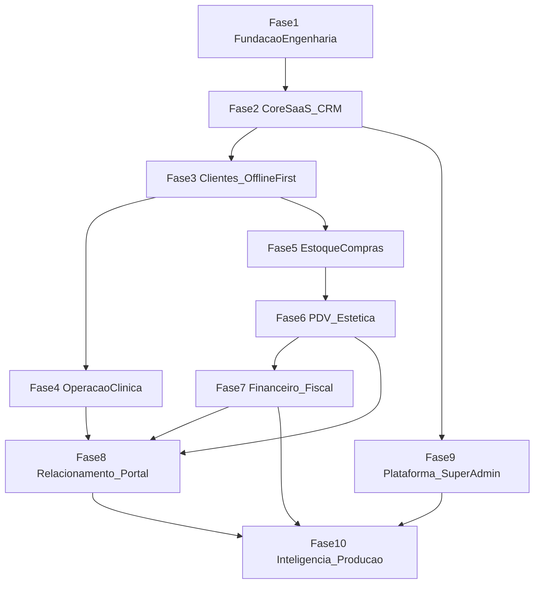

# Roadmap de Desenvolvimento — VetNexus / SysVet

Este roadmap define as etapas de desenvolvimento do SaaS veterinário e petshop **VetNexus** (código: **SysVet**), alinhado à arquitetura documentada em [`agents.md`](agents.md), [`structure.md`](structure.md), [`functions.md`](functions.md) e [`backoffice.md`](backoffice.md).

**Estimativas:** Story Points (SP) na sequência de Fibonacci (1, 2, 3, 5, 8, 13, 21). SP medem esforço relativo, não prazo.

**Documentos-fonte de escopo:**
- [`functions.md`](functions.md) — operação da clínica/petshop (tenant-side)
- [`backoffice.md`](backoffice.md) — plataforma Super Admin (SaaS-side)

---

## Convenções

| Item | Definição |
|------|-----------|
| **Status Concluído** | Implementado, testado e utilizável em fluxo real |
| **Status Parcial** | Scaffold, configuração mínima ou PoC incompleta |
| **Status Pendente** | Não iniciado no código |
| **Camadas** | `Domain` → `Application` → `Infrastructure` → `API` / `Clients` |
| **Padrões obrigatórios** | Clean Architecture, CQRS, Repository, `Result<T>`, TDD, XML docs |
| **Stack** | .NET 10, ASP.NET Core Web API, Blazor WASM (PWA), MAUI Hybrid, EF Core 10, SQL Server (nuvem), SQLite (offline), Identity + JWT, OpenAPI + Scalar |

---

## Estado atual do repositório (baseline)

> Fotografia em **ago/2026**. Scaffolds **não** contam como funcionalidade concluída.

| Área | Status | Evidência |
|------|--------|-----------|
| Solução modular | **Parcial** | `SaaS_Veterinario.slnx`, 19 projetos `.csproj`, pastas espelhadas em `tests/` |
| API | **Parcial** | `src/API/Program.cs` — endpoint `GET /`, OpenAPI + Scalar (dev) |
| Padrão `Result<T>` | **Concluído** | `src/Modules/Core/Domain/Result.cs` + 4 testes em `Core.Tests` |
| Módulos de negócio | **Parcial** | Projetos vazios (`Core`, `Veterinary`, `Petshop`, `Sales`, `Inventory`, `Fiscal`) |
| EF Core / SQL Server | **Pendente** | Sem pacotes, DbContext ou migrations |
| Identity / JWT | **Pendente** | — |
| CQRS / Handlers | **Pendente** | — |
| Blazor WASM | **Parcial** | Template (Home, Counter, Weather) |
| SharedUI | **Parcial** | RCL com componente placeholder |
| MAUI | **Pendente** | `src/Clients/MauiApp/` vazio |
| SQLite / Sync offline | **Pendente** | — |
| CI/CD | **Pendente** | Sem pipeline |
| Módulos ausentes | **Pendente** | `Finance`, `Automations`, `Intelligence`, `TutorPortal`, `Platform` |

**Progresso estimado:** ~10% da Fase 1 concluída (scaffold + API mínima + `Result<T>`).

---

## Mapa de módulos

### Existentes em `src/Modules/`

| Módulo | Responsabilidade |
|--------|------------------|
| **Core** | Identidade, CRM base, sync, abstrações transversais |
| **Veterinary** | Prontuário, agenda clínica, vacinas, internação |
| **Petshop** | Estética, banho e tosa |
| **Sales** | PDV, comissões, pacotes |
| **Inventory** | Estoque, compras, inventário |
| **Fiscal** | NF-e, NFC-e, NFS-e (tenant-side) |

### A criar

| Módulo | Responsabilidade | Referência |
|--------|------------------|------------|
| **Finance** | Contas a pagar/receber, caixa, conciliação, fluxo de caixa | `functions.md` § Financeiro |
| **Automations** | Workers, filas, WhatsApp/SMS/e-mail, campanhas, NPS | `functions.md` § Automação |
| **Intelligence** | Dashboards operacionais, curva ABC, produtividade | `functions.md` § Inteligência |
| **TutorPortal** | App/portal do tutor, e-commerce, site do estabelecimento | `functions.md` § Portal |
| **Platform** | Super Admin: tenants, planos, billing, feature flags | `backoffice.md` |

---

## Visão de dependências

**Riscos técnicos (exigem PoC/ADR antes da implementação definitiva):**
1. Sincronização offline-first (SQLite ↔ SQL Server)
2. Multi-tenancy e isolamento de dados
3. Gateway de assinatura e dunning
4. Fiscal (NF-e/NFC-e/NFS-e) e contingência offline
5. Integrações externas (TEF, WhatsApp, marketplaces)

---

# Fase 1 — Fundação do Repositório e Engenharia

**Objetivo:** Tornar o repositório compilável, testável e pronto para evolução modular contínua.

**Dependências:** Nenhuma.

**Entregáveis:** Solução íntegra, CI verde, DI modular, configuração por ambiente, observabilidade mínima, ADRs iniciais.

**Marco de conclusão:** `dotnet build` e `dotnet test` passam no CI; API registra módulos via extension methods; health check exposto.

| Tarefa | SP | Status |
|--------|-----|--------|
| **1.1 Solução e referências** | 3 | Parcial |
| **1.2 CI/CD** | 5 | Pendente |
| **1.3 DI modular na API** | 5 | Pendente |
| **1.4 Configuração por ambiente** | 3 | Pendente |
| **1.5 Observabilidade e health checks** | 3 | Pendente |
| **1.6 ADRs e documentação arquitetural** | 3 | Pendente |
| **Total Fase 1** | **22 SP** | |

### 1.1 Solução e referências (3 SP) — Parcial

- [x] Criar `SaaS_Veterinario.slnx` com projetos `src/` e `tests/`
- [x] Estrutura Clean Architecture por módulo (`Domain`, `Application`, `Infrastructure`)
- [x] Script `create_structure.sh` para bootstrap de módulos
- [ ] Incluir `MauiApp` na solução (quando workload MAUI disponível)
- [ ] Remover placeholders `Class1.cs` conforme módulos forem implementados
- [ ] Resolver advisory de segurança em `Microsoft.OpenApi` (NU1903)
- [ ] Alinhar duplicatas `roadmap.md`, `agents.md`, `structure.md` (raiz vs `docs/`)

**Aceite:** Build local e no CI sem erros; todos os projetos referenciados na solução.

### 1.2 CI/CD (5 SP) — Pendente

- [ ] Workflow GitHub Actions (ou equivalente): `dotnet restore`, `build`, `test`
- [ ] Cache de NuGet; matriz `net10.0`
- [ ] Relatório de cobertura (mínimo Domain + Application)
- [ ] Gate: PR bloqueado se testes falharem
- [ ] Artefato publicável da API (opcional: container)

**Aceite:** Pipeline verde em push/PR; badge de status no README.

### 1.3 DI modular na API (5 SP) — Pendente

- [ ] `AddCoreModule()`, `AddVeterinaryModule()`, etc. em `src/API/Extensions/`
- [ ] Registro de handlers CQRS, repositórios e DbContexts por módulo
- [ ] Convenção de endpoints por módulo (`MapCoreEndpoints`, etc.)
- [ ] Middleware global de tratamento de `Result<T>` → HTTP status

**Aceite:** API compila referenciando todos os módulos; DI resolve serviços sem registro manual espalhado.

### 1.4 Configuração por ambiente (3 SP) — Pendente

- [ ] `appsettings.{Development,Staging,Production}.json`
- [ ] User Secrets / variáveis de ambiente para connection strings
- [ ] Options pattern tipado por módulo
- [ ] Documentar variáveis obrigatórias em `docs/arquitetura/`

**Aceite:** API sobe em Development com config mínima documentada.

### 1.5 Observabilidade e health checks (3 SP) — Pendente

- [ ] `AddHealthChecks()` — API, SQL Server (quando existir)
- [ ] Logging estruturado (correlation id por request)
- [ ] Endpoint `/health` para orquestradores

**Aceite:** Health check retorna status agregado; logs incluem trace id.

### 1.6 ADRs e documentação arquitetural (3 SP) — Pendente

- [ ] ADR-001: Monólito modular vs microserviços
- [ ] ADR-002: Estratégia de sync offline (Dotmim.Sync vs Outbox/Event Sourcing)
- [ ] ADR-003: Multi-tenancy (schema por tenant vs discriminator)
- [ ] Popular `docs/arquitetura/` e `docs/diagramas/` (diagrama C4 nível 1–2)

**Aceite:** ADRs versionados; diagramas refletem estrutura real de `src/`.

---

# Fase 2 — Core SaaS e CRM

**Objetivo:** Entregar identidade, autorização, CRM básico (usuários, tutores, pets) e contratos de API reutilizáveis por todos os módulos.

**Dependências:** Fase 1.

**Entregáveis:** DbContext Core, migrations, Identity + JWT, CRUD Tutor/Pet, RBAC, auditoria básica.

**Marco de conclusão:** Usuário autenticado cria tutor e pet via API; testes Domain/Application verdes.

| Tarefa | SP | Status |
|--------|-----|--------|
| **2.1 Abstrações de domínio e CQRS** | 8 | Pendente |
| **2.2 EF Core, repositórios e migrations** | 8 | Pendente |
| **2.3 Identity, JWT e RBAC** | 13 | Pendente |
| **2.4 CRM — Tutores e Pets** | 8 | Pendente |
| **2.5 Usuários, perfis e permissões** | 5 | Pendente |
| **2.6 Auditoria e contratos de API** | 5 | Pendente |
| **Total Fase 2** | **47 SP** | |

### 2.1 Abstrações de domínio e CQRS (8 SP)

**Domain**
- [ ] `Entity`, `AggregateRoot`, `ValueObject`, `IDomainEvent`
- [ ] Interfaces `IRepository<T>`, `IUnitOfWork`
- [ ] Expandir `Result<T>` / `Error` com códigos padronizados por módulo

**Application**
- [ ] MediatR (ou equivalente) para Commands/Queries
- [ ] Pipeline behaviors: validação, logging, autorização
- [ ] DTOs e mappers por feature

**Tests**
- [ ] Testes de behaviors e validadores antes dos handlers

**Aceite:** Handler de exemplo retorna `Result<T>`; pipeline registrado na DI.

### 2.2 EF Core, repositórios e migrations (8 SP)

**Infrastructure**
- [ ] Pacotes EF Core 10 + SQL Server
- [ ] `CoreDbContext` com schema lógico `core`
- [ ] Implementação genérica de repositório + Unit of Work
- [ ] Migrations iniciais; seed de roles

**Aceite:** `dotnet ef database update` cria schema; repositório persiste entidade de teste.

### 2.3 Identity, JWT e RBAC (13 SP)

**Infrastructure**
- [ ] ASP.NET Core Identity (usuários, roles, claims)
- [ ] JWT Bearer + refresh token (opcional fase 2.3)
- [ ] Políticas: `Admin`, `Veterinarian`, `Receptionist`, `Cashier`, etc.

**API**
- [ ] Endpoints: register (dev), login, refresh, me
- [ ] `[Authorize]` em endpoints protegidos

**Tests**
- [ ] Testes de integração: login → token → endpoint autorizado

**Aceite:** Token JWT válido acessa recurso protegido; role incorreta retorna 403.

### 2.4 CRM — Tutores e Pets (8 SP)

**Domain:** `Tutor`, `Pet`, `Species`, `Breed`, vínculos e regras de validação.

**Application:** Commands `CreateTutor`, `UpdateTutor`, `CreatePet`, `UpdatePet`; Queries paginadas com filtros.

**Infrastructure:** Mapeamentos EF, índices, soft delete.

**API:** REST `/api/tutors`, `/api/pets` com OpenAPI documentado.

**Tests:** TDD em Domain (CPF/telefone, espécie obrigatória, tutor ativo).

**Referência:** `functions.md` — Módulo Base & CRM.

**Aceite:** CRUD completo tutor/pet; listagem com paginação e busca por nome.

### 2.5 Usuários, perfis e permissões (5 SP)

- [ ] CRUD usuários vinculados ao tenant (quando multi-tenant existir)
- [ ] Perfis customizáveis (matriz permissão × recurso)
- [ ] Preferências de UI: atalhos, filtros salvos, colunas de listagem

**Referência:** `functions.md` — perfis de acesso, teclas de atalho.

**Aceite:** Admin altera permissões; usuário vê apenas menus permitidos.

### 2.6 Auditoria e contratos de API (5 SP)

- [ ] `AuditLog`: quem, quando, entidade, ação, payload resumido
- [ ] Filtro OpenAPI por módulo; versionamento `/api/v1/`
- [ ] Resposta padronizada de erro a partir de `Result.Failure`

**Aceite:** Alteração em tutor gera registro de auditoria consultável.

---

# Fase 3 — Clientes e Offline-First

**Objetivo:** Resolver o gargalo técnico do produto: operação offline com sincronização confiável para SQL Server.

**Dependências:** Fase 2 (entidades CRM + auth).

**Entregáveis:** SharedUI real, Blazor PWA, MAUI Hybrid, SQLite local, motor de sync, PoC E2E.

**Marco de conclusão:** Cadastrar tutor offline no client → reconectar → dado aparece no SQL Server sem conflito não tratado.

| Tarefa | SP | Status |
|--------|-----|--------|
| **3.1 SharedUI — design system base** | 8 | Pendente |
| **3.2 Blazor WASM PWA** | 8 | Pendente |
| **3.3 MAUI Blazor Hybrid** | 13 | Pendente |
| **3.4 SQLite local nos clients** | 8 | Pendente |
| **3.5 Motor de sincronização** | 21 | Pendente |
| **3.6 PoC E2E offline → nuvem** | 5 | Pendente |
| **Total Fase 3** | **63 SP** | |

### 3.1 SharedUI — design system base (8 SP)

- [ ] Migrar `MainLayout`, `NavMenu`, tokens visuais para `src/Clients/SharedUI/`
- [ ] Componentes: `DataGrid`, `FormField`, `Modal`, `Toast`, `LoadingState`
- [ ] Serviços compartilhados: `IAuthState`, `INavigationService`
- [ ] Remover páginas demo (Counter, Weather) dos clients

**Aceite:** BlazorWeb e MAUI renderizam o mesmo layout a partir de SharedUI.

### 3.2 Blazor WASM PWA (8 SP)

- [ ] Manifest + service worker + cache de assets
- [ ] HttpClient autenticado (JWT) apontando para API
- [ ] Telas: login, listagem/cadastro tutor e pet
- [ ] Indicador de conectividade (online/offline/syncing)

**Aceite:** App instalável como PWA; funciona offline para telas já cacheadas.

### 3.3 MAUI Blazor Hybrid (13 SP)

- [ ] Projeto `MauiApp` funcional (Android + Windows mínimo)
- [ ] Referência SharedUI; splash e ícones VetNexus
- [ ] Permissões: câmera (barcode futuro), armazenamento local
- [ ] Publicação pipeline básico (opcional)

**Aceite:** App MAUI abre telas CRM compartilhadas com BlazorWeb.

### 3.4 SQLite local nos clients (8 SP)

- [ ] EF Core SQLite (ou repositório leve) espelhando entidades CRM
- [ ] Migrations locais independentes da nuvem
- [ ] Repositório offline com mesma interface da nuvem (adapter)

**Aceite:** CRUD tutor/pet persiste localmente sem rede.

### 3.5 Motor de sincronização (21 SP)

**Decisão:** Registrar em ADR-002 (Dotmim.Sync **ou** Outbox + delta sync).

**Application / Infrastructure**
- [ ] Tabela/fila `OutboxMessage` (ou equivalente) no client
- [ ] `BackgroundService` na API para ingestão idempotente
- [ ] Versionamento por registro (`RowVersion` / `SyncToken`)
- [ ] Estratégia de conflito documentada (LWW ou merge por campo)
- [ ] Retry exponencial; dead-letter para falhas permanentes

**Tests**
- [ ] Testes de idempotência (reenvio não duplica)
- [ ] Testes de conflito simulado

**Aceite:** Sync bidirecional tutor/pet; fila drena após reconexão.

### 3.6 PoC E2E offline → nuvem (5 SP)

- [ ] Cenário automatizado ou script manual documentado
- [ ] Métricas: tempo de sync, registros pendentes, erros
- [ ] Documentar limitações conhecidas da PoC

**Aceite:** PoC reproduzível descrita em `docs/arquitetura/sync-poc.md`.

---

# Fase 4 — Operação Clínica

**Objetivo:** Entregar agenda, prontuário, vacinas, orçamentos clínicos e internação.

**Dependências:** Fase 3 (sync para uso em campo).

**Referência:** `functions.md` — Atendimento Clínico e Internação.

| Tarefa | SP | Status |
|--------|-----|--------|
| **4.1 Agenda clínica unificada** | 8 | Pendente |
| **4.2 Prontuário veterinário** | 13 | Pendente |
| **4.3 Exames, receitas e anexos** | 8 | Pendente |
| **4.4 Carteira de vacinação e alertas** | 8 | Pendente |
| **4.5 Orçamentos clínicos** | 5 | Pendente |
| **4.6 Internação e mapa de execução** | 13 | Pendente |
| **Total Fase 4** | **55 SP** | |

### 4.1 Agenda clínica unificada (8 SP)

**Domain:** `Appointment`, `ScheduleSlot`, status (agendado, confirmado, em atendimento, concluído, falta).

**Application:** CRUD agenda; visão por profissional/dia; bloqueio de horários.

**Clients:** Calendário SharedUI; sync offline de compromissos.

**Aceite:** Veterinário visualiza agenda do dia; alteração offline sincroniza.

### 4.2 Prontuário veterinário (13 SP)

- [ ] Anamnese, evolução, sinais vitais, diagnóstico
- [ ] Histórico consolidado por pet (timeline)
- [ ] Vínculo atendimento ↔ appointment

**Aceite:** Prontuário completo consultável por pet; edição com auditoria.

### 4.3 Exames, receitas e anexos (8 SP)

- [ ] Modelos de receita padronizados
- [ ] Upload anexos (fotos, vídeos, PDFs) — blob storage
- [ ] Registro de exames clínicos solicitados/realizados

**Aceite:** Anexo associado ao atendimento; download autorizado.

### 4.4 Carteira de vacinação e alertas (8 SP)

- [ ] Protocolos de vacina por espécie/idade
- [ ] Registro de aplicação; próxima dose prevista
- [ ] Query de vacinas atrasadas/previstas (base para Automações)

**Aceite:** Carteira digital exportável; alertas listados no backoffice da clínica.

### 4.5 Orçamentos clínicos (5 SP)

- [ ] Orçamento vinculado a atendimento/pet
- [ ] Status: rascunho, enviado, aprovado, recusado
- [ ] Integração futura com PDV (Fase 6)

**Aceite:** Orçamento aprovado gera item pendente para conversão em venda.

### 4.6 Internação e mapa de execução (13 SP)

- [ ] Leitos/unidades; mapa de pacientes internados
- [ ] Prescrições com horários; administração de medicamentos
- [ ] Evolução diária; histórico de procedimentos

**Aceite:** Mapa de execução exibe prescrições do dia por leito; registro de medicação aplicada.

---

# Fase 5 — Estoque e Compras

**Objetivo:** Controle de produtos, movimentações, compras e inventário mobile.

**Dependências:** Fase 3 (sync + MAUI para barcode).

**Referência:** `functions.md` — Estoque Inteligente.

| Tarefa | SP | Status |
|--------|-----|--------|
| **5.1 Cadastro de produtos e lotes** | 8 | Pendente |
| **5.2 Movimentações e alertas** | 8 | Pendente |
| **5.3 Entrada via XML (NF compra)** | 8 | Pendente |
| **5.4 Perdas, fracionamento e devoluções** | 5 | Pendente |
| **5.5 Inventário mobile (barcode)** | 8 | Pendente |
| **5.6 Etiquetas e sugestão de compras** | 8 | Pendente |
| **Total Fase 5** | **45 SP** | |

### 5.1 Cadastro de produtos e lotes (8 SP)

- [ ] Produto, SKU, código de barras, unidade, fornecedor
- [ ] Lote, validade, custo médio
- [ ] Categorias e campos fiscais básicos

**Aceite:** Produto com múltiplos lotes; saldo calculado por lote.

### 5.2 Movimentações e alertas (8 SP)

- [ ] Entrada, saída, transferência, ajuste
- [ ] Alertas: estoque mínimo, validade próxima
- [ ] Kardex por produto

**Aceite:** Saída reduz saldo; alerta dispara abaixo do mínimo configurado.

### 5.3 Entrada via XML (NF compra) (8 SP)

- [ ] Parser XML NF-e de entrada
- [ ] Mapeamento fornecedor/produto; criação assistida
- [ ] Vinculação com contas a pagar (Fase 7)

**Aceite:** XML importado gera movimentação de entrada conferível.

### 5.4 Perdas, fracionamento e devoluções (5 SP)

- [ ] Motivos: validade, avaria, consumo interno, doação
- [ ] Fracionamento de embalagem; rastreio de saldo fracionado
- [ ] Devolução ao fornecedor

**Aceite:** Perda registrada reduz saldo com motivo auditável.

### 5.5 Inventário mobile (barcode) (8 SP)

- [ ] Contagem cega no MAUI via câmera
- [ ] Divergência vs saldo sistema; ajuste aprovado

**Aceite:** Inventário MAUI atualiza saldo após aprovação.

### 5.6 Etiquetas e sugestão de compras (8 SP)

- [ ] Geração/impressão de etiquetas (PDF/ZPL)
- [ ] Regra de reposição; pedido sugerido por fornecedor

**Aceite:** Relatório de sugestão exportável; etiqueta gerada para produto.

---

# Fase 6 — PDV e Estética

**Objetivo:** Caixa offline integrado a estoque/CRM e operação de banho e tosa.

**Dependências:** Fase 5 (estoque), Fase 4 (agenda clínica base para estética).

**Referência:** `functions.md` — Vendas/PDV e Estética.

| Tarefa | SP | Status |
|--------|-----|--------|
| **6.1 Motor de vendas (PDV)** | 13 | Pendente |
| **6.2 PDV 100% offline** | 8 | Pendente |
| **6.3 Pagamentos e TEF** | 13 | Pendente |
| **6.4 Comissões, descontos, devoluções** | 8 | Pendente |
| **6.5 Pacotes, kits e pré-pagos** | 5 | Pendente |
| **6.6 Estética — banho e tosa** | 13 | Pendente |
| **6.7 Notificações de status (banho)** | 5 | Pendente |
| **Total Fase 6** | **65 SP** | |

### 6.1 Motor de vendas (PDV) (13 SP)

- [ ] Carrinho, itens, serviços, múltiplas formas de pagamento
- [ ] Vínculo cliente/pet; emissão de comprovante
- [ ] Baixa automática de estoque

**Aceite:** Venda concluída reduz estoque e registra receita pendente (Finance).

### 6.2 PDV 100% offline (8 SP)

- [ ] Fila local de vendas; sync com resolução de conflito de estoque
- [ ] Numeração offline segura (sequência reservada ou UUID)

**Aceite:** 10 vendas offline sincronizam sem duplicidade.

### 6.3 Pagamentos e TEF (13 SP)

- [ ] Integração maquininha (TEF/API — PoC com provedor escolhido)
- [ ] Registro transação cartão débito/crédito/pix
- [ ] Estorno parcial/total

**Aceite:** Pagamento cartão registrado com NSU; estorno reflete no caixa.

### 6.4 Comissões, descontos, devoluções (8 SP)

- [ ] Regras por vendedor, veterinário, tosador
- [ ] Limite de desconto por perfil
- [ ] Devolução de venda com estorno estoque/financeiro

**Aceite:** Comissão calculada na venda; devolução reverte saldos.

### 6.5 Pacotes, kits e pré-pagos (5 SP)

- [ ] Kit de produtos; pacote de serviços com saldo de usos
- [ ] Abatimento automático ao consumir serviço

**Aceite:** Pacote banho decrementa saldo a cada atendimento.

### 6.6 Estética — banho e tosa (13 SP)

- [ ] Agenda banhistas/tosadores
- [ ] Ficha digital B&T vinculada ao histórico do pet
- [ ] Consumo automático de insumos (shampoo, etc.) no estoque

**Aceite:** Conclusão do serviço baixa insumos configurados na ficha.

### 6.7 Notificações de status (banho) (5 SP)

- [ ] Eventos: início, em andamento, pronto para retirada
- [ ] Integração com fila (Fase 8) ou SignalR para tempo real

**Aceite:** Tutor recebe notificação ao marcar "pronto" (quando Automações ativo).

---

# Fase 7 — Financeiro e Fiscal

**Objetivo:** Gestão financeira da clínica e conformidade fiscal (NF-e, NFC-e, NFS-e).

**Dependências:** Fase 6 (vendas); criar módulo `Finance`.

**Referência:** `functions.md` — Financeiro e Fiscal.

| Tarefa | SP | Status |
|--------|-----|--------|
| **7.1 Módulo Finance — estrutura** | 5 | Pendente |
| **7.2 Contas a pagar e receber** | 8 | Pendente |
| **7.3 Caixa, sangrias e conciliação** | 13 | Pendente |
| **7.4 Fluxo de caixa e demonstrativos** | 8 | Pendente |
| **7.5 NF-e e NFS-e** | 13 | Pendente |
| **7.6 NFC-e e contingência offline** | 13 | Pendente |
| **7.7 Planejamento fiscal** | 5 | Pendente |
| **Total Fase 7** | **65 SP** | |

### 7.1 Módulo Finance — estrutura (5 SP)

- [ ] Criar `src/Modules/Finance/{Domain,Application,Infrastructure}`
- [ ] Projetos de teste; referências na API e solução
- [ ] Schema lógico `finance` no banco

**Aceite:** Módulo compila e registra DI; migration inicial aplicada.

### 7.2 Contas a pagar e receber (8 SP)

- [ ] Títulos AP/AR; categorias; centros de custo
- [ ] Vínculo com vendas, compras (XML), clientes/fornecedores
- [ ] Projeção saldo previsto vs realizado

**Aceite:** Venda gera AR; XML compra gera AP.

### 7.3 Caixa, sangrias e conciliação (13 SP)

- [ ] Abertura/fechamento de caixa por operador
- [ ] Sangrias e suprimentos
- [ ] Conciliação cartões (TEF) vs recebíveis

**Aceite:** Fechamento de caixa bate com vendas do período ± sangrias.

### 7.4 Fluxo de caixa e demonstrativos (8 SP)

- [ ] Fluxo de caixa diário/mensal
- [ ] DRE mensal simplificada
- [ ] Export CSV/PDF

**Aceite:** Relatório mensal bate com lançamentos AP/AR.

### 7.5 NF-e e NFS-e (13 SP)

- [ ] Integração provedor fiscal (Zeus.Net / Focus NFe — ADR)
- [ ] Emissão a partir de venda/serviço
- [ ] Cancelamento e carta de correção

**Aceite:** NF-e autorizada na SEFAZ em homologação.

### 7.6 NFC-e e contingência offline (13 SP)

- [ ] NFC-e consumidor; fila offline na venda PDV
- [ ] Transmissão automática ao recuperar rede
- [ ] Reconciliação status SEFAZ

**Aceite:** Venda offline emite NFC-e em contingência; transmite após sync.

### 7.7 Planejamento fiscal (5 SP)

- [ ] Relatórios tributários por período
- [ ] Simulação de enquadramento (Simples vs Presumido — escopo inicial)

**Aceite:** Relatório fiscal exportável para contabilidade.

---

# Fase 8 — Relacionamento e Portal do Tutor

**Objetivo:** Automação de comunicação, marketing, NPS e canal digital com o tutor (app, site, e-commerce).

**Dependências:** Fases 4, 6, 7 (dados clínicos, vendas, financeiro).

**Referência:** `functions.md` — Automação/Marketing e Portal/E-commerce.

| Tarefa | SP | Status |
|--------|-----|--------|
| **8.1 Módulo Automations — workers e filas** | 8 | Pendente |
| **8.2 Lembretes WhatsApp/SMS/e-mail** | 8 | Pendente |
| **8.3 Campanhas e NPS** | 8 | Pendente |
| **8.4 Módulo TutorPortal — base** | 5 | Pendente |
| **8.5 App do tutor (login, vacinas, exames)** | 13 | Pendente |
| **8.6 Autoagendamento pelo tutor** | 8 | Pendente |
| **8.7 Site do estabelecimento** | 8 | Pendente |
| **8.8 E-commerce e marketplaces** | 21 | Pendente |
| **Total Fase 8** | **79 SP** | |

### 8.1 Módulo Automations — workers e filas (8 SP)

- [ ] Criar `src/Modules/Automations/`
- [ ] Worker Service / fila (Azure Service Bus, RabbitMQ ou tabela outbox)
- [ ] Templates de mensagem por canal

**Aceite:** Job enfileirado processado com retry e log.

### 8.2 Lembretes WhatsApp/SMS/e-mail (8 SP)

- [ ] Gatilhos: vacina, retorno, aniversário pet, consulta amanhã
- [ ] Opt-in/opt-out; horário comercial
- [ ] Integração provedor (Twilio, Z-API, SendGrid — ADR)

**Aceite:** Lembrete de vacina dispara 7 dias antes; opt-out respeitado.

### 8.3 Campanhas e NPS (8 SP)

- [ ] Campanhas segmentadas (inativos 90 dias, pós-atendimento)
- [ ] Pesquisa NPS com score e comentários
- [ ] Frequência de retorno por cliente

**Aceite:** Campanha dispara para segmento; NPS registrado e reportável.

### 8.4 Módulo TutorPortal — base (5 SP)

- [ ] Projeto client ou área isolada com Identity role `Tutor`
- [ ] API BFF ou endpoints dedicados `/api/tutor-portal/`

**Aceite:** Tutor autentica separado de usuário clínica.

### 8.5 App do tutor (13 SP)

- [ ] PWA ou MAUI: carteira vacinação, histórico exames, timeline atendimentos
- [ ] Push notification (quando disponível)

**Referência:** `functions.md` — Portal do Tutor.

**Aceite:** Tutor visualiza vacinas e exames do pet autorizado.

### 8.6 Autoagendamento pelo tutor (8 SP)

- [ ] Slots disponíveis por serviço/profissional
- [ ] Confirmação/cancelamento; integração agenda clínica/estética

**Aceite:** Agendamento pelo portal aparece na agenda da clínica.

### 8.7 Site do estabelecimento (8 SP)

- [ ] Site gerado (subdomínio `{clinica}.vetnexus.app`)
- [ ] Páginas: serviços, equipe, contato, horários

**Aceite:** Site publicado com dados cadastrais da clínica.

### 8.8 E-commerce e marketplaces (21 SP)

- [ ] Loja sync com estoque físico e preços
- [ ] Pedidos online; atualização automática de estoque
- [ ] Integração marketplace (Mercado Livre/Shopee — PoC 1 canal)

**Aceite:** Pedido e-commerce baixa estoque; preço reflete alteração no backoffice.

---

# Fase 9 — Plataforma e Super Admin

**Objetivo:** Operar o SaaS VetNexus — tenants, planos, billing, feature flags e suporte.

**Dependências:** Fase 2 (Identity base); paralelizável após Fase 2; billing completo após Fase 7.

**Referência:** `backoffice.md` (integral).

| Tarefa | SP | Status |
|--------|-----|--------|
| **9.1 Módulo Platform — estrutura e multi-tenancy** | 13 | Pendente |
| **9.2 Gestão de tenants e filiais** | 13 | Pendente |
| **9.3 Planos, add-ons e feature flags** | 13 | Pendente |
| **9.4 Gateway de assinatura e cobrança** | 21 | Pendente |
| **9.5 Dunning, bloqueio e cupons** | 13 | Pendente |
| **9.6 NFS-e do SaaS e impersonation** | 13 | Pendente |
| **9.7 Auditoria, API keys e health por tenant** | 8 | Pendente |
| **9.8 UI Super Admin (Blazor)** | 13 | Pendente |
| **Total Fase 9** | **107 SP** | |

### 9.1 Módulo Platform — estrutura e multi-tenancy (13 SP)

- [ ] Criar `src/Modules/Platform/{Domain,Application,Infrastructure}`
- [ ] Resolução de tenant (subdomínio, header, claim JWT)
- [ ] Isolamento: schema por tenant **ou** `TenantId` global (ADR-003)
- [ ] Middleware de enforcement em todos os módulos

**Aceite:** Tenant A não acessa dados do Tenant B (teste de integração).

### 9.2 Gestão de tenants e filiais (13 SP)

- [ ] Onboarding: criar tenant + admin + provisionamento schema/seed
- [ ] Status: ativo, suspenso, cancelado, excluído (soft delete)
- [ ] Filiais (multi-CNPJ) vinculadas à matriz

**Referência:** `backoffice.md` §1.

**Aceite:** Novo tenant operacional em < 5 min via backoffice.

### 9.3 Planos, add-ons e feature flags (13 SP)

- [ ] Planos base (Starter, Pro, Hospital 24h)
- [ ] Módulos avulsos (Estética, Fiscal, Automação, PDV Offline)
- [ ] Feature flags por tenant; cache com invalidação
- [ ] Upgrades/downgrades com pró-rata
- [ ] Free trial: dias configuráveis; transição ou bloqueio automático

**Referência:** `backoffice.md` §2.

**Aceite:** Flag desabilita módulo na UI e retorna 403 na API.

### 9.4 Gateway de assinatura e cobrança (21 SP)

- [ ] Integração Stripe / Asaas / Pagar.me (ADR)
- [ ] Cartão recorrente, Pix, boleto
- [ ] Webhooks: pagamento, falha, cancelamento
- [ ] Faturas e histórico de cobrança

**Referência:** `backoffice.md` §3.

**Aceite:** Assinatura recorrente cobrada; webhook atualiza status tenant.

### 9.5 Dunning, bloqueio e cupons (13 SP)

- [ ] Réguas de cobrança (e-mail/SMS); retentativas cartão
- [ ] Bloqueio após X dias: apenas tela de pagamento
- [ ] Cupons: percentual/valor fixo, limite uso, expiração

**Aceite:** Inadimplência simulada suspende acesso operacional.

### 9.6 NFS-e do SaaS e impersonation (13 SP)

- [ ] Emissão NFS-e VetNexus → clínica a cada liquidação
- [ ] Impersonation auditada (suporte loga como tenant)
- [ ] Trilha: quem impersonou, quando, IP

**Referência:** `backoffice.md` §1 e §3.

**Aceite:** Impersonation gera audit log imutável; sessão expira.

### 9.7 Auditoria, API keys e health por tenant (8 SP)

- [ ] Logs de login (IP, device, geo)
- [ ] Auditoria alterações backoffice (planos, descontos)
- [ ] API keys para parceiros/contabilidades
- [ ] Dashboard health: volume dados, requests, espaço

**Referência:** `backoffice.md` §4.

**Aceite:** API key revogada falha imediatamente; métricas por tenant visíveis.

### 9.8 UI Super Admin (Blazor) (13 SP)

- [ ] App separada ou área `/platform` com role `SuperAdmin`
- [ ] Telas: tenants, planos, billing, flags, auditoria, métricas SaaS

**Aceite:** Operador VetNexus gerencia tenant sem acesso SQL direto.

---

# Fase 10 — Inteligência, Escala e Produção

**Objetivo:** BI operacional e SaaS, hardening de produção, conformidade e rollout.

**Dependências:** Fases 7–9 (dados financeiros, billing, operação).

| Tarefa | SP | Status |
|--------|-----|--------|
| **10.1 Módulo Intelligence — dashboards tenant** | 13 | Pendente |
| **10.2 Métricas SaaS (MRR, churn, LTV, CAC)** | 13 | Pendente |
| **10.3 Curva ABC, produtividade e adoção de módulos** | 8 | Pendente |
| **10.4 Performance, cache e escalabilidade** | 8 | Pendente |
| **10.5 Backup, DR e observabilidade avançada** | 8 | Pendente |
| **10.6 Segurança, LGPD e pentest** | 13 | Pendente |
| **10.7 Testes de carga e rollout** | 8 | Pendente |
| **Total Fase 10** | **71 SP** | |

### 10.1 Módulo Intelligence — dashboards tenant (13 SP)

- [ ] Criar `src/Modules/Intelligence/`
- [ ] Painel vendas/serviços tempo real
- [ ] Widgets configuráveis por perfil

**Referência:** `functions.md` § Inteligência.

**Aceite:** Dashboard carrega KPIs do dia < 3s em tenant médio.

### 10.2 Métricas SaaS (13 SP)

- [ ] MRR, ARR, fluxo de caixa global VetNexus
- [ ] Churn rate, LTV, CAC (integração CRM vendas/marketing)
- [ ] Relatório inadimplência mensal

**Referência:** `backoffice.md` §5.

**Aceite:** Métricas batem com billing ± tolerância documentada.

### 10.3 Curva ABC, produtividade e adoção (8 SP)

- [ ] Ranking clientes e produtos (curva ABC)
- [ ] Produtividade por profissional
- [ ] Heatmap adoção de módulos por tenant

**Aceite:** Relatórios exportáveis; adoção reflete flags/planos reais.

### 10.4 Performance, cache e escalabilidade (8 SP)

- [ ] Cache distribuído (Redis) para queries pesadas
- [ ] Paginação obrigatória em listagens; índices revisados
- [ ] Load test baseline documentado

**Aceite:** P95 API < 500ms em endpoints críticos (ambiente staging).

### 10.5 Backup, DR e observabilidade avançada (8 SP)

- [ ] Backup automático SQL Server; restore testado
- [ ] APM (Application Insights ou OpenTelemetry)
- [ ] Alertas: erro 5xx, fila sync, falha billing

**Aceite:** Restore de backup validado trimestralmente (runbook).

### 10.6 Segurança, LGPD e pentest (13 SP)

- [ ] Política retenção dados; exportação/exclusão titular
- [ ] Criptografia at-rest e in-transit; rotação secrets
- [ ] Pentest externo; correção achados críticos

**Aceite:** RIPD/LGPD documentado; zero achados críticos abertos.

### 10.7 Testes de carga e rollout (8 SP)

- [ ] Teste carga: N tenants × M usuários simultâneos
- [ ] Estratégia rollout: canary → beta → GA
- [ ] Runbook incidentes e status page

**Aceite:** Sistema suporta meta de tenants definida em ADR; rollout executado.

---

## Resumo de Story Points

| Fase | Nome | SP | Status global |
|------|------|-----|---------------|
| 1 | Fundação do Repositório e Engenharia | 22 | Parcial (~15%) |
| 2 | Core SaaS e CRM | 47 | Pendente |
| 3 | Clientes e Offline-First | 63 | Pendente |
| 4 | Operação Clínica | 55 | Pendente |
| 5 | Estoque e Compras | 45 | Pendente |
| 6 | PDV e Estética | 65 | Pendente |
| 7 | Financeiro e Fiscal | 65 | Pendente |
| 8 | Relacionamento e Portal do Tutor | 79 | Pendente |
| 9 | Plataforma e Super Admin | 107 | Pendente |
| 10 | Inteligência, Escala e Produção | 71 | Pendente |
| **Total** | | **619 SP** | **~2% concluído** |

> O roadmap anterior totalizava **183 SP** e cobria ~40% de `functions.md` e 0% de `backoffice.md`. Este documento reflete o escopo completo dos três documentos-fonte.

---

## Ordem de execução recomendada

1. **Fase 1** — desbloqueia CI, DI e ADRs
2. **Fase 2** — desbloqueia todos os módulos tenant-side
3. **Fase 3** — PoC sync (risco #1); não adiar
4. **Fase 9.1–9.3** — multi-tenancy e flags **antes** de escalar clientes reais (pode iniciar após Fase 2)
5. **Fase 5 → 6 → 7** — cadeia estoque → vendas → financeiro/fiscal
6. **Fase 4** — paralela à Fase 5 após Fase 3
7. **Fase 8** — após dados operacionais estáveis
8. **Fase 9.4–9.8** — billing completo após Finance
9. **Fase 10** — contínua a partir de staging com dados reais

### Prioridade imediata (próximos sprints)

| Sprint | Foco | Tarefas |
|--------|------|---------|
| S1 | Engenharia | 1.2 CI/CD, 1.3 DI modular, 1.4 Config |
| S2 | Core | 2.1 CQRS, 2.2 EF Core, 2.3 Identity |
| S3 | CRM | 2.4 Tutor/Pet, 2.6 Auditoria |
| S4 | Clients | 3.1 SharedUI, 3.2 Blazor PWA |
| S5 | Offline | 3.4 SQLite, 3.5 Sync (PoC), 3.6 E2E |

---

## Critérios transversais de aceite (Definition of Done)

Toda tarefa marcada como concluída deve atender:

1. **Testes:** testes unitários Domain/Application escritos antes ou junto (TDD); integração para fluxos API críticos
2. **Documentação:** XML docs em APIs públicas; OpenAPI/Scalar atualizado
3. **Living docs:** `agents.md` / `structure.md` atualizados se houver novo módulo ou pasta
4. **Result pattern:** handlers retornam `Result<T>`; sem exceções para fluxo de negócio
5. **Autorização:** endpoints protegidos; permissões verificadas
6. **Multi-tenant:** quando aplicável, isolamento validado por teste
7. **Offline:** quando aplicável, operação offline + sync idempotente demonstrada
8. **Auditoria:** operações sensíveis registradas

---

## Rastreabilidade escopo → fase

| Documento | Seção | Fase(s) |
|-----------|-------|---------|
| `functions.md` | Base & CRM | 2 |
| `functions.md` | Clínico e Internação | 4 |
| `functions.md` | Estética | 6 |
| `functions.md` | PDV | 6 |
| `functions.md` | Estoque | 5 |
| `functions.md` | Financeiro | 7 |
| `functions.md` | Fiscal | 7 |
| `functions.md` | Automação/Marketing | 8 |
| `functions.md` | Portal/E-commerce | 8 |
| `functions.md` | Inteligência | 10 |
| `backoffice.md` | Tenants | 9 |
| `backoffice.md` | Planos/Flags | 9 |
| `backoffice.md` | Billing | 9 |
| `backoffice.md` | Auditoria/Segurança | 9, 10 |
| `backoffice.md` | BI SaaS | 10 |

---

*Última atualização: agosto/2026 — alinhado ao estado do repositório SysVet e aos documentos `functions.md` e `backoffice.md`.*
