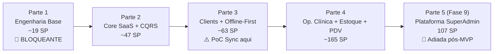

# Plano de Implementação — SysVet / VetNexus

> **Atualizado em:** 15/08/2026
> **Base:** [`roadmap.md`](file:///home/kley/sysvet/docs/roadmap.md) + estado real do repositório
> **Decisões de arquitetura incorporadas:** todas as 4 perguntas abertas respondidas ✅

---

## Decisões de Arquitetura (Registradas)

| # | Questão | Decisão |
|---|---------|---------|
| **ADR-001** | Prioridade: MVP operacional vs. Plataforma SaaS | **Parte 3 (Offline-First) antes da Fase 9 (SuperAdmin)** — entregar MVP funcional primeiro |
| **ADR-002** | Estratégia de Sync offline | **PoC primeiro** — avaliar `Dotmim.Sync` vs `Outbox Pattern` antes de decidir implementação definitiva |
| **ADR-003** | Multi-tenancy | **Schema separado por tenant** — isolamento físico completo no SQL Server |
| **ADR-004** | Banco de dados de desenvolvimento | **EF Core InMemory / SQLite** no CI — SQL Server real adiado para sprints de infra |

> [!IMPORTANT]
> Essas decisões impactam diretamente a Parte 2 (EF Core com suporte a schema dinâmico) e a Parte 3 (PoC de Sync). Os ADRs serão documentados em `docs/arquitetura/` como artefato da tarefa 1.E.

---

## Estado Real do Repositório (Baseline Verificado)

| Componente | Status Real | Evidência |
|---|---|---|
| `Result<T>` + `Error` | ✅ Concluído | [`Result.cs`](file:///home/kley/sysvet/src/Modules/Core/Domain/Result.cs) |
| `Entity` base | ✅ Concluído | [`Entity.cs`](file:///home/kley/sysvet/src/Modules/Core/Domain/Entity.cs) |
| `Tutor`, `Pet`, `PetEnums` | ✅ Concluído | [`Entities/`](file:///home/kley/sysvet/src/Modules/Core/Domain/Entities/) |
| Value Objects: `Cpf`, `Email`, `Phone` | ✅ Concluído | [`ValueObjects/`](file:///home/kley/sysvet/src/Modules/Core/Domain/ValueObjects/) |
| Testes de Domain (32 testes) | ✅ Concluído | [`Core.Tests/Domain/`](file:///home/kley/sysvet/tests/Modules/Core.Tests/Domain/) |
| API com OpenAPI + Scalar | ✅ Concluído | [`Program.cs`](file:///home/kley/sysvet/src/API/Program.cs) |
| `ServiceCollectionExtensions` | ⚠️ Parcial | Só tem `AddApiDocumentation()` |
| `Core.Application` | 🔴 Vazio | Apenas `Class1.cs` placeholder |
| `Core.Infrastructure` | 🔴 Vazio | Sem DbContext, EF, repositórios |
| CI/CD | 🔴 Ausente | Sem `.github/workflows/` |
| DI Modular (`AddCoreModule()`, etc.) | 🔴 Ausente | Extension methods por módulo inexistentes |
| Identity / JWT | 🔴 Ausente | — |
| Blazor WASM / MAUI | 🔴 Não funcional | Templates vazios |

**Progresso estimado:** ~12% da Fase 1.

> **Domain Core avançou além do roadmap:** `Entity`, `AggregateRoot`, `Tutor`, `Pet` e VOs já existem — parte do escopo das tarefas 2.1 e 2.4 já está concluída no Domain.

---

## Sequência de Partes

> **Fase 9 (SuperAdmin)** é prioridade **após** o MVP operacional (Partes 1–4). Pode ser paralelizada por outro desenvolvedor após a Parte 2, mas não bloqueia o MVP.

---

# PARTE 1 — Finalizar Fase 1: Engenharia Base
> **SP restantes:** ~19 SP | **Prioridade:** BLOQUEANTE — nada avança sem isso

### Objetivo
Repositório compilável, CI verde, DI modular e configuração por ambiente prontos.

---

### 1.A — Limpeza e Higiene (1 SP)

#### [MODIFY] Vários arquivos
- Remover todos os `Class1.cs` placeholder (`Core.Application`, `Core.Infrastructure`, `Veterinary.*`, `Petshop.*`, `Sales.*`, `Inventory.*`, `Fiscal.*`)
- Resolver advisory `NU1903` de `Microsoft.OpenApi` (atualizar pacote)
- Alinhar duplicatas de docs (raiz vs `docs/`)

**Aceite:** `dotnet build` sem warnings de placeholder.

---

### 1.B — CI/CD com GitHub Actions (5 SP)

#### [NEW] `.github/workflows/ci.yml`
- `dotnet restore` → `dotnet build` → `dotnet test`
- Cache de pacotes NuGet
- Matriz de runtime `net10.0`
- Relatório de cobertura (Coverlet + ReportGenerator)
- **Banco:** usar EF Core InMemory nos testes — sem dependência de SQL Server no CI ✅
- Gate: PR bloqueado se testes falharem

**Aceite:** Badge verde no README; PR bloqueado em falha.

---

### 1.C — DI Modular na API (5 SP)

#### [MODIFY] [`ServiceCollectionExtensions.cs`](file:///home/kley/sysvet/src/API/Extensions/ServiceCollectionExtensions.cs)
- Adicionar `AddCoreModule()` — registra Application handlers, repositórios e Infrastructure do Core

#### [NEW] `src/API/Extensions/EndpointExtensions.cs`
- `MapCoreEndpoints()` — convenção de endpoints por módulo
- Middleware global de tradução `Result<T>` → HTTP status codes (`200`, `400`, `404`, `409`, `500`)

#### [MODIFY] [`Program.cs`](file:///home/kley/sysvet/src/API/Program.cs)
- Incorporar `builder.Services.AddCoreModule()` e `app.MapCoreEndpoints()`

**Aceite:** API compila referenciando o módulo Core; DI resolve serviços sem registro manual espalhado.

---

### 1.D — Configuração por ambiente e Health Checks (6 SP)

#### [NEW] Arquivos de configuração
- `src/API/appsettings.Staging.json`
- `src/API/appsettings.Production.json`
- Options tipados: `JwtSettings`, `ConnectionStrings` (placeholder para SQL Server futuro)

#### [MODIFY] [`Program.cs`](file:///home/kley/sysvet/src/API/Program.cs)
- `AddHealthChecks()` + endpoint `/health`
- Logging estruturado com correlation ID por request (Serilog ou built-in)

**Aceite:** API sobe em Development; `/health` retorna `Healthy`.

---

### 1.E — ADRs e Documentação Arquitetural (3 SP)

#### [NEW] `docs/arquitetura/ADR-001-monolito-modular.md`
Decisão: Monólito modular com Clean Architecture.

#### [NEW] `docs/arquitetura/ADR-002-sync-offline.md`
Decisão: **PoC antes de escolher** — documentar as duas opções (`Dotmim.Sync` vs `Outbox Pattern`), critérios de avaliação e quando a decisão final será tomada (fim da Parte 3.D.PoC).

#### [NEW] `docs/arquitetura/ADR-003-multi-tenancy.md`
Decisão: **Schema separado por tenant** no SQL Server.
- Implicações: `CoreDbContext` com schema dinâmico resolvido via `ITenantContext`
- Migrations executadas por tenant no provisionamento
- Impersonation de tenant apenas via SuperAdmin (Fase 9)

#### [NEW] `docs/arquitetura/ADR-004-banco-desenvolvimento.md`
Decisão: **EF Core InMemory no CI** — SQL Server real somente em staging/produção.

**Aceite:** 4 ADRs versionados em `docs/arquitetura/`.

---

# PARTE 2 — Fase 2: Core SaaS, CQRS e EF Core
> **SP:** ~47 SP | **Desbloqueado após:** Parte 1

### Objetivo
CQRS com MediatR, EF Core com suporte a schema por tenant, Identity + JWT, CRUD Tutor/Pet e auditoria.

> [!IMPORTANT]
> **Impact de ADR-003 (schema por tenant):** o `CoreDbContext` precisa aceitar um schema dinâmico desde o início. Isso requer um `ITenantContext` injetado no DbContext para resolver o schema correto — mesmo que o multi-tenancy completo só venha na Fase 9.

> [!NOTE]
> **Domain Core já está à frente:** `Entity`, `AggregateRoot`, `Tutor`, `Pet` e VOs existem. As tarefas abaixo constroem as camadas de Application e Infrastructure.

---

### 2.A — Interfaces de Repositório e Contratos CQRS (8 SP)

#### [MODIFY] `src/Modules/Core/Domain/`
- `IRepository<T>` e `IUnitOfWork` (interfaces abstratas de domínio)
- `IDomainEvent` base
- `ITutorRepository`, `IPetRepository` com assinaturas específicas
- Expandir `Result<T>` com códigos de erro padronizados (`ErrorCode` enum por módulo)

#### [NEW] `src/Modules/Core/Application/`
- Remover `Class1.cs`; configurar `Core.Application.csproj` com MediatR e FluentValidation
- `ICommand<TResult>`, `IQuery<TResult>` — contratos base CQRS
- `ValidationBehavior<TRequest, TResponse>` — pipeline behavior
- `LoggingBehavior<TRequest, TResponse>` — pipeline behavior

#### [NEW] `tests/Modules/Core.Tests/Application/`
- Testes dos pipeline behaviors (TDD)

**Aceite:** Handler de exemplo retorna `Result<T>`; pipeline de validação registrado na DI.

---

### 2.B — EF Core, DbContext com Schema Dinâmico e Repositórios (8 SP)

> [!IMPORTANT]
> Implementar `ITenantContext` desde já, mesmo que o tenant seja fixo (`default`) nos primeiros sprints. Isso evita refatoração dolorosa quando a Fase 9 chegar.

#### [NEW] `src/Modules/Core/Infrastructure/`
- Pacotes: `Microsoft.EntityFrameworkCore`, `Microsoft.EntityFrameworkCore.SqlServer`, `Microsoft.EntityFrameworkCore.InMemory`, `Microsoft.EntityFrameworkCore.Design`
- `ITenantContext` — interface com `TenantId` e `SchemaName`
- `CoreDbContext` — schema resolvido via `ITenantContext` injetado
- Configurações EF: `TutorConfiguration`, `PetConfiguration`
- `Repository<T>` genérico + `UnitOfWork`
- `InMemoryTenantContext` para testes/CI (schema `default`)

#### [NEW] Migrations
- Migration inicial com schema parametrizado

**Aceite:** Repositório persiste Tutor via InMemory no CI; estrutura pronta para SQL Server.

---

### 2.C — Identity, JWT e RBAC (13 SP)

#### [NEW] `src/Modules/Core/Infrastructure/Identity/`
- ASP.NET Core Identity com `AppUser` vinculado ao `TenantId`
- JWT Bearer + refresh token
- Políticas: `Admin`, `Veterinarian`, `Receptionist`, `Cashier`
- `TenantClaimMiddleware` — injeta `TenantId` no `ITenantContext` por request

#### [NEW] Endpoints
- `POST /api/v1/auth/login` → retorna JWT + refresh token
- `POST /api/v1/auth/refresh`
- `GET /api/v1/auth/me`

#### [NEW] Testes de integração
- Login → token → endpoint autorizado (TDD)
- Role incorreta → 403

**Aceite:** Token JWT válido acessa endpoint protegido; role errada retorna 403; `TenantId` resolvido do claim JWT.

---

### 2.D — CRUD Tutor/Pet via CQRS (8 SP)

#### [NEW] `src/Modules/Core/Application/Tutors/`
- `RegisterTutorCommand` + `RegisterTutorCommandHandler`
- `UpdateTutorCommand` + handler
- `GetTutorByIdQuery` + `GetTutorByIdQueryHandler`
- `ListTutorsQuery` (paginada, filtros por nome/CPF)
- Validators FluentValidation para cada command

#### [NEW] `src/Modules/Core/Application/Pets/`
- `CreatePetCommand` + handler
- `UpdatePetCommand` + handler
- `GetPetByIdQuery` + handler
- `ListPetsQuery` (paginada, filtro por tutor)

#### [NEW] Endpoints REST
- `POST /api/v1/tutors` | `GET /api/v1/tutors` | `GET /api/v1/tutors/{id}` | `PUT /api/v1/tutors/{id}`
- `POST /api/v1/pets` | `GET /api/v1/pets/{id}` | `PUT /api/v1/pets/{id}`
- `GET /api/v1/tutors/{id}/pets`

#### [NEW] Testes (TDD com NSubstitute)
- `RegisterTutorCommandHandlerTests`
- `GetTutorByIdQueryHandlerTests`
- `CreatePetCommandHandlerTests`

**Aceite:** CRUD completo via API com InMemory; >50 testes passam no CI.

---

### 2.E — Auditoria e Contratos de API (5 SP)

#### [NEW] `src/Modules/Core/Domain/Auditing/`
- `AuditLog` — entidade: `TenantId`, `UserId`, `EntityName`, `Action`, `OccurredAt`, `PayloadSummary`
- `IAuditLogger` — interface de domínio

#### [MODIFY] API
- Versionamento `/api/v1/` em todos os endpoints
- Resposta de erro padronizada via `ProblemDetails` gerado por `Result.Failure`
- Filtros OpenAPI por módulo/tag

**Aceite:** Alteração em Tutor gera registro de auditoria; API retorna `ProblemDetails` padronizado.

---

# PARTE 3 — Fase 3: Clients e Offline-First
> **SP:** ~63 SP | **Desbloqueado após:** Parte 2

### Objetivo
SharedUI real, Blazor PWA, MAUI Hybrid, SQLite local e — crítico — PoC do motor de sincronização.

> [!WARNING]
> **Risco técnico #1 do projeto:** A PoC de sincronização (3.D.PoC, ~5 SP) deve acontecer **antes** da implementação completa do motor (21 SP). Resultado da PoC define o ADR-002.

---

### 3.A — SharedUI Design System (8 SP)

#### [MODIFY] `src/Clients/SharedUI/`
- `MainLayout`, `NavMenu` com tokens visuais VetNexus
- Componentes Razor reutilizáveis:
  - `<DataGrid>`, `<FormField>`, `<Modal>`, `<Toast>`, `<LoadingState>`
  - `<SyncStatusBadge>` — exibe `Online` / `Offline` / `Sincronizando...`
- Serviços compartilhados: `IAuthState`, `INavigationService`, `IConnectivityService`
- Remover páginas demo (Counter, Weather) de BlazorWeb e MAUI

**Aceite:** BlazorWeb e MAUI renderizam o mesmo layout a partir de SharedUI.

---

### 3.B — Blazor WASM PWA (8 SP)

#### [MODIFY] `src/Clients/BlazorWeb/`
- `manifest.json` + Service Worker + cache de assets estáticos
- `HttpClient` autenticado (Bearer JWT) com `DelegatingHandler` de retry
- Telas: Login, Dashboard (stub), Tutores (lista + cadastro), Pets
- Indicador de conectividade integrado ao `<SyncStatusBadge>`

**Aceite:** App instalável como PWA; telas cacheadas funcionam offline.

---

### 3.C — MAUI Blazor Hybrid (13 SP)

#### [MODIFY] `src/Clients/MauiApp/`
- Projeto MAUI funcional (Android mínimo + Windows)
- Referência `SharedUI`; splash screen e ícones VetNexus
- Permissões: câmera (barcode futuro), armazenamento local, notificações
- Compartilhamento de páginas Blazor com BlazorWeb via SharedUI

**Aceite:** App MAUI abre telas de Tutor/Pet compartilhadas com BlazorWeb.

---

### 3.D — SQLite Local, PoC de Sync e Motor Definitivo (29 SP)

> Esta tarefa tem **duas fases internas**:

#### Fase 3.D.1 — SQLite Local (8 SP)

- EF Core SQLite espelhando entidades `Tutor` e `Pet`
- Migrations locais independentes da nuvem
- `IOfflineRepository<T>` — mesma interface do repositório online (Adapter Pattern)
- Funciona sem rede: CRUD Tutor/Pet persiste localmente

**Aceite:** CRUD Tutor/Pet funciona sem rede no MAUI e no Blazor PWA.

---

#### Fase 3.D.2 — PoC de Sincronização (5 SP) → **define ADR-002**

> [!IMPORTANT]
> **Executar PoC antes de decidir a implementação do motor completo.**
> Avaliar as duas abordagens na prática:

| Critério | `Dotmim.Sync` | `Outbox Pattern` manual |
|---|---|---|
| Complexidade de setup | Baixa | Alta |
| Controle sobre conflitos | Limitado | Total |
| Suporte a schema por tenant | Verificar | Sim (customizável) |
| Manutenção longo prazo | Depende da lib | Equipe controla |
| SP estimados (impl. completa) | ~13 SP | ~21 SP |

- [x] PoC `Dotmim.Sync`: sync bidirecional Tutor com SQLite ↔ SQL Server InMemory
- [x] PoC `Outbox Pattern`: `OutboxMessage` table + `BackgroundService` de ingestão
- [x] Medir: latência, conflitos, idempotência, schema por tenant
- [x] Documentar resultado em `ADR_002_Sincronizacao.md` (decisão final: Outbox Pattern)

**Aceite:** ✅ PoC concluída; ADR-002 aprovado e atualizado com decisão final pelo Outbox Pattern e diretrizes de Resolução de Conflitos, Pull e Ordem Sequencial (FIFO/Stop-on-first-error).

---

#### Fase 3.D.3 — Motor de Sincronização Completo (16 SP) → após ADR-002 decidido

- Implementar a estratégia vencedora da PoC
- Suporte a `TenantId` no sync (compatível com ADR-003)
- Estratégia de conflito: LWW (Last Write Wins) — documentada no ADR
- Retry exponencial; dead-letter para falhas permanentes
- `BackgroundService` na API para ingestão idempotente
- Testes: idempotência (reenvio não duplica) e conflito simulado

**Aceite:** Sync bidirecional Tutor/Pet; fila drena após reconexão; ADR-002 com decisão implementada.

---

### 3.E — PoC E2E Offline → Nuvem (5 SP)

- Script ou cenário automatizado: criar Tutor offline → desconectar → reconectar → verificar no servidor
- Métricas: tempo de sync, registros pendentes, erros
- Documentar em `docs/arquitetura/sync-poc.md`

**Aceite:** PoC E2E reproduzível documentada.

---

# PARTE 4 — Fases 4–6: Operação Clínica, Estoque e PDV
> **SP:** ~165 SP | **Desbloqueado após:** Parte 3

### Objetivo
Agenda clínica, prontuário veterinário, estoque com barcode, PDV offline e estética (banho & tosa).

> Estas fases seguem o padrão de Clean Architecture + CQRS + TDD estabelecido nas partes anteriores. Serão detalhadas sprint a sprint após a conclusão da Parte 3, usando o roadmap [`roadmap.md`](file:///home/kley/sysvet/docs/roadmap.md) (Fases 4, 5 e 6) como referência.

| Fase | Módulo | SP | Dependência |
|---|---|---|---|
| **4** | Operação Clínica (Agenda, Prontuário, Vacinas, Internação) | 55 SP | Parte 3 |
| **5** | Estoque e Compras (Produtos, Movimentações, Barcode, Inventário MAUI) | 45 SP | Parte 3 |
| **6** | PDV e Estética (Caixa offline, TEF, Banho & Tosa) | 65 SP | Fases 4 + 5 |

---

# PARTE 5 — Fase 9: Plataforma e Super Admin
> **SP:** 107 SP | **Inicia após:** Parte 4 (ou paralela após Parte 2 se houver outro dev)

### Objetivo
Operar o SaaS VetNexus — tenants, planos, billing, feature flags e Super Admin UI.

> [!NOTE]
> Com ADR-003 decidido (**schema por tenant**), o módulo `Platform` já tem a estratégia de isolamento definida. O `ITenantContext` implementado na Parte 2 serve de base para o provisionamento de schemas na Fase 9.

---

## Tabela de Sprints Revisada

| Sprint | Parte | Foco | Tarefas | SP |
|--------|-------|------|---------|-----|
| **S1** | 1 | Engenharia base | 1.A Limpeza + 1.B CI/CD + 1.C DI Modular | ~11 SP |
| **S2** | 1→2 | Config + ADRs + CQRS base | 1.D Config/Health + 1.E ADRs + 2.A Contratos CQRS | ~17 SP |
| **S3** | 2 | EF Core + Identity | 2.B EF Core/Schema dinâmico + 2.C Identity/JWT | ~21 SP |
| **S4** | 2 | CRM + Auditoria | 2.D CRUD Tutor/Pet + 2.E Auditoria | ~13 SP |
| **S5** | 3 | Clients base | 3.A SharedUI + 3.B Blazor PWA | ~16 SP |
| **S6** | 3 | MAUI + SQLite | 3.C MAUI + 3.D.1 SQLite Local | ~21 SP |
| **S7** | 3 | PoC de Sync ⚠️ | 3.D.2 PoC + decisão ADR-002 + 3.E E2E | ~10 SP |
| **S8** | 3 | Motor de Sync | 3.D.3 Implementação definitiva | ~16 SP |
| **S9+** | 4 | Operação Clínica | Fases 4, 5, 6 (sprint a sprint) | ~165 SP |

---

## Definition of Done (transversal)

Toda tarefa marcada como concluída deve atender:

1. ✅ **TDD** — testes escritos antes (Red → Green → Refactor)
2. ✅ **Result Pattern** — handlers retornam `Result<T>`; zero exceções para fluxo de negócio
3. ✅ **XML Docs** — APIs públicas documentadas
4. ✅ **OpenAPI/Scalar** — endpoints visíveis e documentados
5. ✅ **DI Modular** — registro via `AddXxxModule()` no módulo
6. ✅ **TenantId** — operações isoladas por tenant (quando aplicável)
7. ✅ **Living Docs** — `agents.md` / `structure.md` atualizados se houver novo módulo/pasta
8. ✅ **CI verde** — pipeline passa após o PR

---

## Decisões em Aberto (Nenhuma)

> Todas as 4 questões arquiteturais foram respondidas. ✅
> O único ponto pendente é a **decisão final do ADR-002**, que será tomada após a PoC no Sprint S7.
